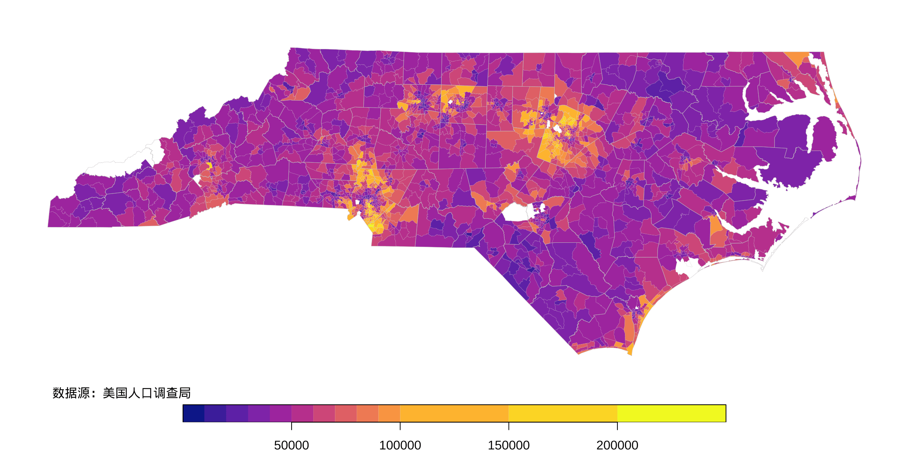
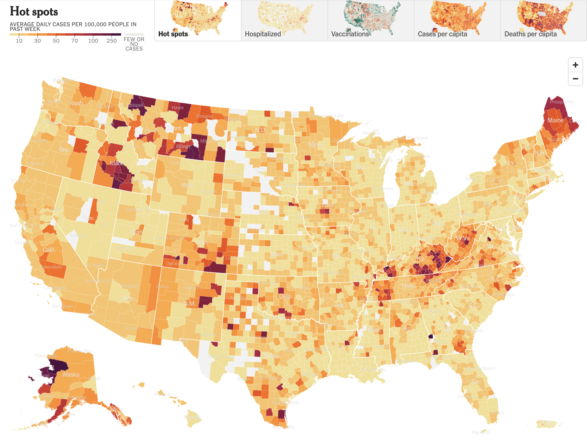
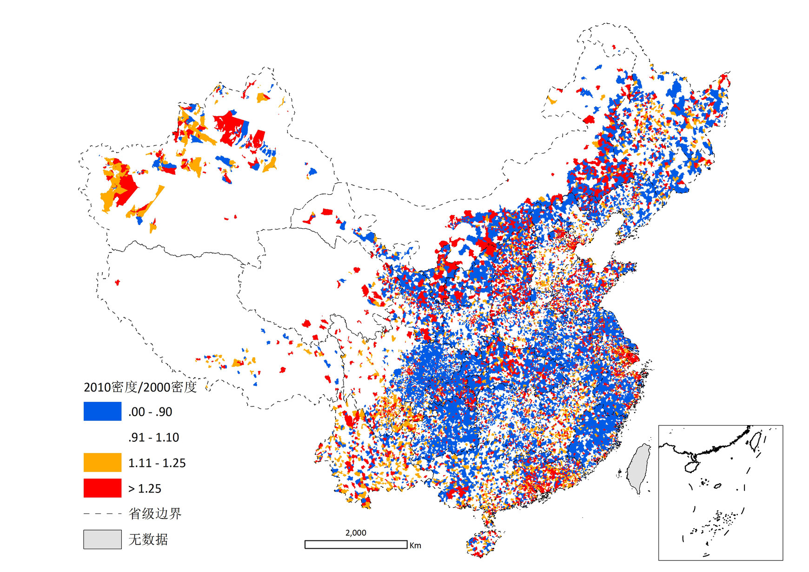
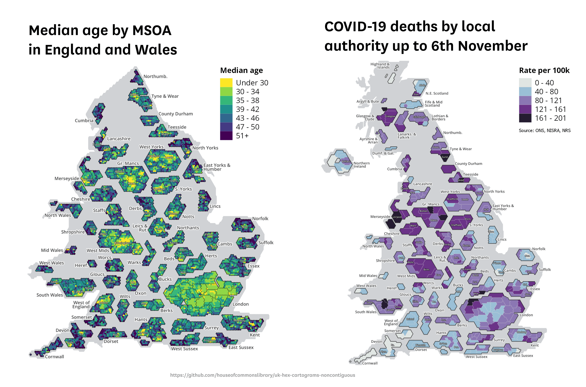

```{css, echo=FALSE}
.sidebar {
  border: 1px solid #ccc;
}

.rmdwarn {
  border: 1px solid #EA4335;
}

.rmdnote {
  border: 1px solid #FBBC05;
}

.rmdtip {
  border: 1px solid #34A853;
}

.sidebar, .rmdwarn, .rmdnote, .rmdtip {
  border-left-width: 5px;
  border-radius: 5px;
  padding: 1em;
  margin: 1em 0;
}

div.rmdwarn::before, div.rmdnote::before, div.rmdtip::before {
  display: block;
  font-size: 1.1em;
  font-weight: bold;
  margin-bottom: 0.25em;
}

div.rmdwarn::before {
  content: "警告";
  color: #EA4335;
}

div.rmdnote::before {
  content: "注意";
  color: #FBBC05;
}

div.rmdtip::before {
  content: "提示";
  color: #34A853;
}

.rmdinfo {
  border: 1px solid #ccc;
  border-left-width: 5px;
  border-radius: 5px;
  padding: 1em;
  margin: 1em 0;
}
div.rmdinfo::before {
  content: "声明";
  color: block;
  display: block;
  font-size: 1.1em;
  font-weight: bold;
  margin-bottom: 0.25em;
}

.full-width {
  width: 100vw;
  margin-left: calc(50% - 50vw);
}

.full-width .caption {
  text-align: center;
}


figure {
  text-align: center;
}

div.img {
  text-align: center;
  display: block; 
  margin-left: auto; 
  margin-right: auto;
}
```

::: rmdinfo
本文引用的所有信息均为公开信息，仅代表作者本人观点，与就职单位无关。
:::

```{r setup}
#| echo=FALSE

knitr::opts_chunk$set(
  comment = "#",
  message = FALSE,
    error = FALSE,
     tidy = FALSE,
    cache = FALSE,
     echo = TRUE,
 collapse = TRUE
)
```


# 本文概览


空间地理可视化的内容非常丰富，涉及空间坐标投影、操作空间数据、选择图形种类、选择绘图工具等。就图形种类而言，对标鼎鼎大名的收费 BI（Business Intelligence） 工具[Tableau](https://www.tableau.com/zh-cn/solutions/maps)，至少包含最常见的面量图、比例符号地图、点分布图、流线图、蜘蛛图（飞线图）、热图。其中的「面量图」通常又叫专题地图、地区分布图、统计地图，英文一般为[Choropleth map](https://en.wikipedia.org/wiki/Choropleth_map)，典型样例是基于统计年鉴的各类专题数据的地理可视化，国家地理信息公共服务平台提供了[专题图层服务](https://zhfw.tianditu.gov.cn/)，可以快速地查看各个统计指标。在美国和日本的国家统计局官网，地区分布图用于展示各类指标[@Meyer1975]。衡量一个部门、一个业务、一个公司、一个行业，乃至一个国家都有一套金字塔式的指标体系，而国家每年发布的统计年鉴就包含一套衡量经济和社会发展情况的指标体系，涵盖人口、土地、生产、消费等等专题，省、市、区县以及自治区、州、县等各级地方统计局每年也会发布一份地方统计年鉴。


接下来，本文分四个部分展开介绍地区分布图，分别是单变量情形、多变量情形、本文小结和未来展望。


单变量情形中以 **latticeExtra** 包[@latticeExtra]内置的数据集 USCancerRates 为例，以地区分布图形式展示美国 1999-2003 年度各郡的年平均癌症死亡率，此处专题的含义是「人口死亡率」，显而易见，癌症死亡率只是一方面，还有流感死亡率等，癌症可以分类型，如乳腺癌、子宫癌等，人又可以分属性，如性别、年龄、种族等等。在数据操作、指标计算和分面绘图等方面从零开始介绍绘制地区分布图的过程，包括基础数据操作以及六个绘图工具 **maps** 包[@Becker1993]、**latticeExtra** 包、**ggplot2** 包[@Wickham2022]、**tmap** 包[@Tennekes2018]、**sf** 包[@Pebesma2018]和 **mapsf** 包[@mapsf2022]，阐述数据指标「年平均癌症死亡率」的实际含义、指标口径和计算过程，从易到难，层层深入，以期达到出版级的水准，探索出最佳实践。


多变量情形中以美国人口调查局发布的调查数据为基础，分析北卡罗来纳州各郡社区普查级的家庭月收入与白人占比的空间相关性。先以单变量的地区分布图描述各个普查区域里家庭月收入的空间分布，接着和二元变量的地区分布图形成对比，展示相关性的空间分布。


本文小结部分总结了 7 种绘图方案的情况，提炼了其间的关联关系，一些绘图经验，希望帮助读者加深理解和学习。


未来展望部分从应用场景和绘图技术方面继续提供一些示例，供读者继续探索。


# 单变量情形


## 美国各郡的年平均癌症死亡率分布

下面以 [**latticeExtra** 包](https://latticeextra.r-forge.r-project.org/)[@latticeExtra]内置的 USCancerRates 数据集为例介绍分面，同时展示多个观测指标的空间分布。USCancerRates 数据集来自[美国国家癌症研究所](https://statecancerprofiles.cancer.gov/)（National Cancer Institute，简称 NCI）。根据1999-2003年的5年数据，分男女统计癌症年平均死亡率（单位十万分之一），这其中的癌症数是所有癌症种类之和。癌症死亡率根据2000年美国[标准人口年龄分组](https://seer.cancer.gov/stdpopulations/stdpop.19ages.html)调整，分母人口数量由 NCI 根据普查的人口数调整，即将各年各个年龄段的普查人口数按照 2000 年的**美国标准人口年龄分组**换算。因**latticeExtra** 包没有提供数据集的加工过程，笔者结合 NCI 网站信息，对此数据指标的调整过程略加说明，这里面其实隐含很多的道理。

人口数每年都会变的，为使各年数据指标可比，人口划分就保持一致，表\@ref(tab:us-std-pop) 展示 1940-2000 年各个年龄段（共19个年龄组）的标准人口数，各个年龄段的普查人口数换算成年龄调整的标准人口数，换算公式为：

$$
某年龄段标准人口数 = 某年龄段普查人口数 / 总普查人口数 * 1000000.
$$

以 2000 年的 10-14 岁年龄段标准人口数为例，即：

$$
73032 = 20056779 / 274633642 * 1000000.
$$


```{r us-std-pop}
#| echo=FALSE
us_std_pop <- readRDS(file = "data/us_std_pop.rds")
knitr::kable(us_std_pop, format = "markdown", caption = "1940-2000 年美国标准人口分组")
```


年龄调整的比率（Age-adjusted Rates）的定义详见[NCI 网站](https://seer.cancer.gov/seerstat/tutorials/aarates/definition.html)，它是一个根据年龄调整的加权平均数，权重根据年龄段人口在标准人口中的比例来定，一个包含年龄 $x$ 到年龄 $y$ 的分组，其年龄调整的比率计算公式如下：

$$
aarate_{x-y} = \sum_{i=x}^{y}\Big[ \big( \frac{count_i}{pop_i} \big)  \times \big( \frac{stdmil_i}{\sum_{j=x}^{y} stdmil_j} \big) \times 100000 \Big]
$$

一个具体的例子可见[网站](https://seer.cancer.gov/seerstat/tutorials/aarates/step3.html)，篇幅所限，此处仅以2000年举例，一个年龄段 00 years 死亡人数 **29**（可看作婴儿死亡人数），总人数 **139879**，则年龄调整的死亡率：

$$
aarate_{0-0} = \frac{29}{139879}*\frac{3794901}{274633642}*100000 = 0.2864
$$

读者可能有疑惑，一系列复杂的调整是为什么？指标稳定性和可比性。稳定不是代表不变，稳定是不受轻易干扰。从各社区、各郡、各州乃至国家，从下往上聚合数据的时候，分年龄、种族、性别等下钻/上卷的时候，有的郡总人口可能相对很少，死亡人数也很少。可比性是指组与组间可比，且随时间变化依然可比，刻画因癌症死亡的相对风险。


```{r}
#| echo=TRUE
# 加载死亡率数据
data(USCancerRates, package = "latticeExtra")
# 查看 Alabama 的 Pickens County 的数据
subset(x = USCancerRates, subset = state == "Alabama" & county == "Pickens County")
```

以 Alabama 的 Pickens County 为例，1999-2003年平均年龄调整的男性癌症死亡率为 363.7（单位：十万分之一），在 95% 置信水平下，置信限为 $[311.1, 423.2]$。根据最新的五年数据显示 2014-2018 年男性癌症死亡率为 479.8，95% 置信水平下的置信区间为 $[425.7, 539.3]$。简单验证一下，就会发现有意思的现象，置信区间不是关于观测的癌症死亡率对称，且离置信区间中心尚有距离， $\frac{311.1 + 423.2}{2} = 367.1 \neq 363.7$。一般来说，100000 人中有 363.7 人因癌症死亡，死亡人数较多（比如大于100）的情况下，二项分布可用正态分布逼近，置信区间上下限应该分别为：

```{r}
#| echo=TRUE
qnorm(p = 1 - 0.05 / 2)
# 置信下限
363.7 - 1.96 * sqrt(363.7 / 100000 * (1 - 363.7 / 100000) / 100000) * 100000
# 置信上限
363.7 + 1.96 * sqrt(363.7 / 100000 * (1 - 363.7 / 100000) / 100000) * 100000
```

而美国国家癌症研究所给的置信带更宽，更保守一些，显然这里面的算法没这么简单。以阿拉巴马州为例，将所有的郡死亡率及其置信区间绘制出来，如图\@ref(fig:alabama-ci-rank)所示，整体来说，偏离置信区间中心都很小。

```{r alabama-ci-rank}
#| fig.cap="1999-2003 年美国阿拉巴马州各个郡的年平均癌症死亡率",
#| fig.width=8,
#| fig.height=10,
#| fig.align="center",
#| fig.showtext=TRUE,
#| echo=FALSE
us_cancer_rates <- reshape(
  data = USCancerRates,
  # 需要转行的列，也可以用列序号代替
  varying = c(
    "LCL95.male", "rate.male", "UCL95.male",
    "LCL95.female", "rate.female", "UCL95.female"
  ),
  times = c("男性", "女性"), # 构成新列 sex 的列值
  v.names = c("LCL95", "rate", "UCL95"), # 列转行 列值构成的新列，指定名称
  timevar = "sex", # 列转行 列名构成的新列，指定名称
  idvar = c("state", "county"), # 可识别郡的编码
  # 原数据有 3041 行，性别字段只有两个取值，转长格式后有 2*3041 行
  new.row.names = 1:(2 * 3041),
  direction = "long"
)
alabama_us_cancer_rates <- subset(x = us_cancer_rates, subset = state == "Alabama")
library(ggplot2)
ggplot(data = alabama_us_cancer_rates, aes(x = rate, xmin = LCL95, xmax = UCL95, y = reorder(county, rate, max), colour = sex)) +
  geom_pointrange() +
  labs(x = "癌症死亡率", y = "郡", colour = "性别") +
  theme_minimal()
```

不难看出，女性癌症死亡率整体上低于男性，且各个地区的死亡率有明显差异。NCI [网站](https://statecancerprofiles.cancer.gov/confidenceintervals.html)仅对置信区间的统计意义给予解释，这跟统计学课本上没有太多差别，没有提供具体的计算过程。可以推断的是必然使用了泊松、伽马一类的偏态分布来刻画死亡人数的分布，疑问尚未解开，欢迎大家讨论。


::: rmdwarn
癌症死亡率相关数据仅可用于统计报告和分析，不可用于其他目的，请遵守[相关法律规定](https://statecancerprofiles.cancer.gov/help/data-use.html)。
:::


### maps


**maps** 包[@Becker1993]内置的美国郡地图数据欠缺一部分，阿拉斯加、夏威夷和波多黎各都没有。数据集 USCancerRates 没有夏威夷、波多黎各各个郡的数据，阿拉斯加的部分郡有数据，如图\@ref(fig:us-cancer-rates-maps)所示，不少郡没有收集到癌症死亡率数据，以灰色表示。值得一提的是，关于死亡率分级，不同的分法会带给人不同的印象甚至是错觉，此处是可以有操作空间的，特定的死亡率分割方式可以让男女死亡率的空间分布**看起来**差异不大或很大[@Kolak2020]，详细介绍见 Marynia Kolak 和 Susan Paykin 在 2021 R/Medicine 大会上的[视频](https://youtu.be/-HvRISFkQZQ)和[网页](https://makosak.github.io/Intro2RSpatialMed/02-choropleth.html)材料。


分析和展示地理信息数据是一项常规任务，约 30 年前，Richard A. Becker 等为 S 语言引入地理可视化，特别是本文介绍的地区分布图，以及简单的区域面积和区域中心的计算能力[@Becker1993;@Becker1995]，而后到了 2003年，Ray Brownrigg、Thomas P Minka 和 Alex Deckmyn 等将其引入 R 语言社区并持续维护至今[@maps]。除了最基础的 **maps** 包，还有坐标投影 **mapproj** 包[@mapproj]，以及提供更多地图数据的 **mapdata** 包[@mapdata]。那个时候，因缺乏一些基础工具，在地图数据获取、空间数据操作和可视化方面都不太容易，仅用这些能做到下图\@ref(fig:us-cancer-rates-maps)已属不易。

```{r us-cancer-rates-maps}
#| fig.cap="1999-2003 年美国各个郡的年平均癌症死亡率分布",
#| fig.width=8,
#| fig.height=10,
#| fig.align="center",
#| fig.showtext=TRUE
# 加载数据
data(USCancerRates, package = "latticeExtra")
library(maps)
# 郡地图数据
us_county <- map("county", plot = FALSE, fill = TRUE, projection = "polyconic")
# 奈何 maps 内置的地图数据不全，仅保留部分观察数据
USCancerRates2 <- subset(x = USCancerRates, subset = rownames(USCancerRates) %in% us_county$names)
# 调色板
colors <- viridisLite::plasma(13)
# 图例文本
leg.txt <- mapply(paste, 50*0:12, 50*1:13, collapse = " ", sep = "~")
# 癌症死亡率划分区间
USCancerRates2$colorBuckets_male <- as.numeric(cut(USCancerRates2$rate.male, 50*0:13))
# 根据郡名称给地图上每个区域的癌症死亡率匹配颜色
colorsmatched_male <- USCancerRates2$colorBuckets_male[match(us_county$names, rownames(USCancerRates2))]
# 对女性癌症死亡率类似操作
USCancerRates2$colorBuckets_female <- as.numeric(cut(USCancerRates2$rate.female, 50*0:13))
colorsmatched_female <- USCancerRates2$colorBuckets_female[match(us_county$names, rownames(USCancerRates2))]
# 绘图
par(mar = c(0, 0, 3, 0), mfrow = c(2, 1))
# 添加地图背景
map("county",
  col = "grey80", fill = TRUE, resolution = 0,
  lty = 0, projection = "polyconic"
)
# 绘制区县地图
map("county",
  col = colors[colorsmatched_male], fill = TRUE, resolution = 0,
  lty = 0, projection = "polyconic", add = TRUE
)
# 添加州边界线
map("state",
  col = "white", fill = FALSE, add = TRUE,
  lty = 1, lwd = 0.2, projection = "polyconic"
)
map.scale()
# 添加图标题
title("1999-2003 年美国各个郡的年平均癌症死亡率（单位：十万分之一）", line = 2)
mtext(text = "男性", side = 3, adj = 0.5)
par(mar = c(1, 0, 2, 0))
map("county",
  col = "grey80", fill = TRUE, resolution = 0,
  lty = 0, projection = "polyconic"
)
map("county",
  col = colors[colorsmatched_female], fill = TRUE, resolution = 0,
  lty = 0, projection = "polyconic", add = TRUE
)
# 添加州边界线
map("state",
  col = "white", fill = FALSE, add = TRUE,
  lty = 1, lwd = 0.2, projection = "polyconic"
)
map.scale()
mtext(text = "女性", side = 3, adj = 0.5)
mtext(text = "数据源：美国国家癌症研究所", side = 1, adj = 0)
# 添加图例
legend("bottomright",
  legend = c(leg.txt, "NA"), title = "死亡率", box.col = NA, border = NA,
  horiz = FALSE, fill = c(colors, "grey80"), cex = 0.85, xjust = 0.5
)
```


在数据操作方面，麻烦的是建立数据指标和各个地理区域的映射，上面反复用到函数 `match()`，Base R 有很多这样短小精悍的函数。下面简单介绍一下以助理解，函数 `match()` 返回一个向量，向量的长度与参数 x 一致，向量的元素是整型的，表示参数 x 中的元素出现在参数 table 中的位置，下面是三个小示例：

```{r}
#| echo=TRUE
match(x = c("A", "B"), table = c("A"))
match(x = c("A", "B"), table = c("C", "A"))
match(x = c("A", "B"), table = c("C", "A", "D"))
```

另外，**maps** 包内置的地图数据制作起来比较复杂，也很长时间没有更新了，笔者不推荐读者再从零开始构建 map 数据对象。**sp** 包[@Pebesma2005]发布后，**maps** 包支持将 Spatial 数据对象转为 map 数据对象，这相当于引入了 **sp** 包及其生态在空间数据获取和数据操作方面的能力[@Bivand2013]。目前，美国国家人口统计局已提供了历年的州、郡、普查级多个比例尺的行政区划地图数据，配合 **sf** 包，可以很好地解决地理可视化的背景底图问题。一些以前看起来很难的问题，随着时间变迁，技术革新，已经解决了。


### latticeExtra

**maps** 包是基于 Base R 绘图系统的，以线和多边形为基础，辅以颜色填充，还没有任何分层绘图的概念，Deepayan Sarkar 将其引入新的 Trellis（栅格）图形系统，这就有了 **latticeExtra** 包 [@latticeExtra]，它是以 **lattice** 包[@Sarkar2008]为基础的，特别适合多元数据可视化，不管数据是「宽格式」还是「长格式」都能轻松应对，既保留了 Base R 那种精细操作图形元素的能力，也引入图层面板的概念。如图\@ref(fig:us-cancer-rates-lattice)，在代码形式上将所有的操作都集于一身，没有严格的分层绘图，保留更大的灵活性的代价是提升了复杂性。

```{r us-cancer-rates-lattice}
#| fig.cap="1999-2003 年美国各个郡的年平均癌症死亡率分布",
#| fig.width=8,
#| fig.height=10,
#| fig.align="center",
#| fig.showtext=TRUE
# 加载数据
data(USCancerRates, package = "latticeExtra")
# 美国州边界数据
us_state <- map("state", plot = FALSE, fill = TRUE, projection = "polyconic")
library(lattice)
# 绘图
latticeExtra::mapplot(rownames(USCancerRates) ~ rate.female + rate.male,
  # 观测数据
  data = USCancerRates,
  # 修改默认的面板函数
  panel = function(x, y, map, ...) {
    # 对未收集到癌症死亡率数据的郡，添加郡边界线
    panel.lines(x = us_county$x, y = us_county$y, lty = 1, lwd = 0.2, col = "black")
    latticeExtra::panel.mapplot(x, y, map, ...)
  },
  # 郡地图数据为背景
  map = us_county,
  # 填充地图用的调色板
  colramp = viridisLite::plasma,
  # 覆盖郡边界线
  border = NA,
  # 多图布局 2 行 1 列
  layout = c(1, 2),
  # 死亡率分桶数
  # cuts = 14, # 指定 breaks 后就不需要 cuts
  # 死亡率数据分割点
  breaks = 50 * 0:13,
  # 仅展示地图数据中包含的郡死亡率数据
  subset = rownames(USCancerRates) %in% us_county$names,
  # 取消坐标轴刻度
  scales = list(draw = F),
  # 修改分面展示文本
  strip = strip.custom(factor.levels = c("女性", "男性")),
  # 去掉横轴标签
  xlab = "",
  # 添加图例标题
  legend = list(top = list(
    fun = grid::textGrob("死亡率", y = 0.1, x = 1.03)
  )),
  # 常规图形参数列表 trellis.par.get('par.sub.text')
  par.settings = list(
    # 副标题放在左下角
    par.sub.text = list(
      font = 2,
      just = "left",
      x = grid::unit(5, "mm"),
      y = grid::unit(5, "mm")
    ),
    # 分面边界和背景色
    strip.border = list(col = "white"),
    strip.background = list(col = "white"),
    # 轴线设置白色以隐藏
    axis.line = list(col = "white")
  ),
  # 副标题
  sub = "数据源：美国国家癌症研究所",
  # 主标题
  main = "1999-2003 年美国各个郡的年平均癌症死亡率"
) +
  # 添加州边界
  latticeExtra::layer(panel.lines(
    x = us_state$x, y = us_state$y,
    lty = 1, lwd = 0.2, col = "white"
  ))
```

用 **lattice** 包绘图往往可以一个函数搞定，参数非常多，都放在一起，这和 Base R 的绘图函数类似，也同时提供全局图形参数控制，但似乎更加复杂。下面谈几个细节：

1.  只需传给参数 `colramp` 一个生成颜色值向量的函数即可更改调色板，比如 R 内置的 `hcl.colors()` 或 `terrain.colors()` 等，为保持全文配色风格一致，图中配色采用 **viridisLite** 包提供的 plasma 调色板。

1.  参考 Markus Gesmann 在 2015 年写的一篇文章[@Gesmann2015]，设置 Lattice 图形参数 `par.settings` 对图中的标题做了细致的调节，比如副标题的文本 `par.sub.text` 所有可调整的细节有：

    ```{r}
    #| echo=TRUE
    trellis.par.get('par.sub.text')
    ```

    想必读者已看出其规律，以 R 语言的列表结构来传递各个层级的图形参数值。

1.  参考 SO 论坛[帖子](https://stackoverflow.com/questions/7373487/)设置参数 `strip` 自定义了分面子图的标题文本，再在 `par.settings` 里对背景 `strip.background` 和边界 `strip.border` 微调，而类似的设置在 **ggplot2** 包的主题函数 `theme()` 里[也有](https://ggplot2.tidyverse.org/reference/theme.html)，在 R 控制台执行 `formalArgs(ggplot2::theme)`  可获得主题函数的参数列表。

1.  读者下一个疑惑可能是如何知道所有的图形控制参数，以及控制的精细程度，Deepayan Sarkar 在书里以图\@ref(fig:trellis-par)归纳了，纵轴是图形参数，横轴是参数值名称列表[@Sarkar2008]，按图索骥一定有所帮助。

(ref:lattice-par) **lattice** 包常用图形参数一览

```{r trellis-par}
#| fig.cap="(ref:lattice-par)",
#| fig.width=6,
#| fig.height=8,
#| fig.align="center",
#| echo=FALSE,
#| fig.showtext=TRUE

# 修改自帮助文档 ?trellis.par.get()
tp <- trellis.par.get()
# 去掉不常用的参数设置选项
unusual <- c(
  "grid.pars", "fontsize", "clip", "axis.components",
  "layout.heights", "layout.widths"
)
tp[names(tp) %in% unusual] <- NULL
# 抽取 pars 中的参数名称
extract_names <- function(name, pars) {
  expand.grid(x = name, y = names(`[[`(pars, name)), z1 = 1)
}
# 抽取结果保存为 data.frame
dat1 <- do.call("rbind", lapply(names(tp), FUN = extract_names, pars = tp))
# 初始化数据框
dat2 <- data.frame(
  expand.grid(x = levels(dat1$x), y = levels(dat1$y)),
  z2 = 0
)
# 填充数据框
dat <- merge(x = dat2, y = dat1, by = c("x", "y"), all.x = T)
dat <- within(dat, {
  z <- z1 | z2
})

# 绘图
levelplot(z ~ y * x,
  data = dat, scales = list(
    draw = T,
    # 去掉图形上边、右边多余的刻度线
    x = list(rot = 45, alternating = 1, tck = c(1, 0)),
    y = list(alternating = 1, tck = c(1, 0))
  ),
  xlab = "参数值名称", ylab = "图形参数", colorkey = FALSE,
  panel = function(x, y, z, ...) {
    panel.abline(
      v = unique(as.numeric(x)),
      h = unique(as.numeric(y)),
      col = "grey"
    )
    panel.xyplot(x, y, pch = 16 * z, ...)
  }
)
```

参数控制的效果预览如图 \@ref(fig:show-settings) 所示，不难看出，**lattice** 包[@Sarkar2008]可以提供精细化的图形调整，是一个非常成熟的绘图工具。

```{r show-settings}
#| fig.cap="图形控制参数",
#| fig.width=9,
#| fig.height=6,
#| echo=FALSE,
#| fig.align="center"

library(lattice)
show.settings()
```
```{r}
#| eval=FALSE,
#| echo=FALSE
library(lattice)
trellis.device(
  device = postscript, color = TRUE, file = "lattice.ps",
  paper = "letter", horizontal = TRUE, onefile = TRUE
)
# 设置全局主题
# trellis.par.set(ggplot2like())
show.settings()
dev.off()
# latticeExtra 包内置经济学人杂志的主题
trellis.par.set(theEconomist.theme())
xyplot(window(sunspot.year, start = 1900),
  main = "Sunspot cycles", sub = "Number per year",
  par.settings = theEconomist.theme(box = "transparent"),
  lattice.options = theEconomist.opts()
)
```

如前所述，**lattice** 和 **ggplot2** 同出一脉，既然 **ggplot2** 有图层的概念，**lattice** 自然也有，除了 提供丰富的内置图层（约**100**个，读者可在控制台运行 `apropos('panel')` 查看当前环境下可用的图层），也支持用户自定义图层，图\@ref(fig:lattice-panel-superpose) 展示叠加图层 `panel.superpose` 的效果，传递自定义的符号给 `pch` 参数，实际上修改了默认图形参数 `"superpose.symbol"`。

```{r lattice-panel-superpose}
#| fig.cap="panel 叠加图层：左图默认散点图层，右图符号图层",
#| fig.width=8,
#| fig.height=4,
#| fig.align="center",
#| echo=TRUE
p1 <- xyplot(Sepal.Length ~ Sepal.Width, data = iris, groups = Species)
p2 <- xyplot(Sepal.Length ~ Sepal.Width,
  data = iris, groups = Species,
  pch = c("L", "M", "N"), panel = panel.superpose
)
print(p1, split = c(1, 1, 2, 1), more = TRUE)
print(p2, split = c(2, 1, 2, 1), more = FALSE)
```

此外，**latticeExtra** 扩展了图层功能，特别是 `layer()` 函数，可在主体绘图函数之后直接叠加新图层。如上图\@ref(fig:us-cancer-rates-lattice)，在 `latticeExtra::mapplot()` 完成主体绘图工作后，添加美国各州边界线，有助于识别郡位置。大家应该都有这样一种感觉，将一张只有中国国家边界的地图放在面前，你不一定能清晰地指出每一个省份的位置，但只要画上各个省的边界，你肯定能指出更多的省份位置，类似地，从省到市、乃至区县，边界给了我们很好的参照。

### ggplot2

考虑到 **maps** 包内置的地图数据的缺陷，**ggplot2** 包的流行度，下面采用 **ggplot2** 包绘制分面地区分布图，相比于 **latticeExtra** 包，**ggplot2** 包更适合「长格式」的数据，因此，需要先重塑 USCancerRates 数据集，将郡死亡率数据和郡地理边界数据配对，根据死亡率的分布设置合适分段，最后恢复地图数据的原始顺序。数据操作过程中有两点强调：

1. 数据重塑：USCancerRates 数据集除了 state 和 county 列，剩余列是由三个原子指标按性别维度衍生出来的，分别是癌症死亡率及其置信区间的上、下限值。在「宽格式」转「长格式」过程中，要注意转化前后各个列名的对应关系。

1. 数据关联：先将地图数据放左边，观测数据放右边，以 LEFT JOIN （左关联） 的方式关联起来，接着将连续性的死亡率数据分段，最后调用绘图函数绘制地区分布图。

```{r}
#| echo=TRUE
# 宽格式转长格式
us_cancer_rates <- reshape(
  data = USCancerRates,
  # 需要转行的列，也可以用列序号代替
  varying = c(
    "LCL95.male", "rate.male", "UCL95.male",
    "LCL95.female", "rate.female", "UCL95.female"
  ),
  times = c("男性", "女性"), # 构成新列 sex 的列值
  v.names = c("LCL95", "rate", "UCL95"), # 列转行 列值构成的新列，指定名称
  timevar = "sex", # 列转行 列名构成的新列，指定名称
  idvar = c("state", "county"), # 可识别郡的编码
  # 原数据有 3041 行，性别字段只有两个取值，转长格式后有 2*3041 行
  new.row.names = 1:(2 * 3041),
  direction = "long"
)
# 从 usmapdata 包获取地图数据
county_df <- usmapdata::us_map("counties")
# 给每个郡的癌症死亡率数据配上地图数据
dat <- merge(county_df, us_cancer_rates, by.x = c("full", "county"), by.y = c("state", "county"), all.y = T)
# 准备州边界线数据
state_df <- usmapdata::us_map("states")
# 癌症死亡率分级
dat$rate_d <- cut(dat$rate, breaks = 50*0:13)
# 恢复地图数据顺序
dat <- dat[order(dat$order), ]
```

[^figure-details]: 除了七个主要的绘图步骤，在图形配色、长宽尺寸、字体大小等方面都需要打磨，这是相当花费时间的。

数据准备工作完成后，除了在细节上不断试错外[^figure-details]，绘图过程主要有七个步骤：

1. 底图：绘制美国郡地图，填充灰色背景，以此为底图。
1. 映射：添加每个郡的癌症死亡率数据，填充颜色根据死亡率而定，以浅白色绘制郡的边界线，且将线调细一些，与后面州的边界线形成层次。
1. 边界：添加美国各个州的边界线，帮助熟悉美国地图的从州到郡快速定位。
1. 配色：类似前文设置，采用 `plasma` 调色板，未采集到死亡率数据的郡填充灰色，和地图背景融为一体。
1. 布局：以函数 `facet_wrap()` 实现分面，分面标题放在图形上方，布局为两行一列。
1. 标题：添加整个图形的主标题、副标题和图例标题。
1. 主题：设置整个图形主题样式 `theme_void()` 以符合地图特色，将图形主标题位置居中。

```{r us-cancer-rates-ggplot2}
#| fig.cap="1999-2003 年美国各个郡的年平均癌症死亡率分布",
#| fig.width=8,
#| fig.height=10,
#| fig.align="center",
#| fig.showtext=TRUE
library(ggplot2)
ggplot() +
  geom_polygon(data = county_df, aes(x, y, group = group), fill = "grey80") +
  geom_polygon(data = dat, aes(x, y, group = group, fill = rate_d), colour = alpha("white", 1 / 4), size = 0.1) +
  geom_polygon(data = state_df, aes(x, y, group = group), colour = "gray80", fill = NA, size = 0.15) +
  scale_fill_viridis_d(option = "plasma", na.value = "grey80") +
  facet_wrap(~sex, ncol = 1, strip.position = "top") +
  labs(
    fill = "死亡率", title = "1999-2003 年美国各个郡的年平均癌症死亡率",
    caption = "数据源：美国国家癌症研究所"
  ) +
  theme_void(base_size = 13) +
  theme(plot.title = element_text(hjust = 0.5))
```

尽管已经调整了上图\@ref(fig:us-cancer-rates-ggplot2)的长宽比例，可一旦和非 **ggplot2** 绘制的图形对比，就可以看出明显变形了。


### tmap

同 **sf** 包[@Pebesma2018]的绘图函数 `plot()` 一样，**tmap** [@Tennekes2018] 也是基于 Base R 图形系统，但使用语法更加贴合 **ggplot2** 包[@Wickham2022]，对空间数据可视化有更多专业支持，比如基于比例的符号/气泡图[@Susumu2006] [^symbol-map]和基于二维核密度估计的热力图[@Tennekes2018]。

[^symbol-map]: @Susumu2006 基于 2000 年日本长崎县长崎市的町村级行政边界地图数据，以及当年关于儿童人口普查数据，以比例气泡图展示人口的空间分布，是 R 语言社区最早一幅用 **maps** 包绘制的比例气泡地图。顺便一提，长崎市大约相当于咱们的地级市，粗略地讲，往上都道府县是一级，往下町村为一级，中间是市区一级。


**tmap** 支持 **sp** 包提供的 Spatial 类数据对象，也支持 **sf** 包提供的 Simple Features 类数据对象，众所周知，后者是新一代更好的工具，因此接下来的示例都将基于 **sf** 包。首先从美国人口调查局下载州和郡级别的[多边形边界数据](https://www.census.gov/geographies/mapping-files/time-series/geo/tiger-line-file.html)，再类似 **usmapdata** 包对阿拉斯加、夏威夷和波多黎各做适当的调整，借助 **tidycensus** 包[@tidycensus]让这个过程变得容易，调整地图数据的代码与源文档放在一起，读者可自取。

```{r}
# 准备地图数据
library(sf)
us_states_shifted <- readRDS(file = "data/us_states_shifted.rds")
us_county_shifted <- readRDS(file = "data/us_county_shifted.rds")
# 合并地图数据和观测数据
us_county_cancer2 <- merge(
  x = us_county_shifted, y = us_cancer_rates,
  by.x = c("STATE_NAME", "NAMELSAD"),
  by.y = c("state", "county"), all.x = TRUE
)
```

准备好数据后，绘图过程比较类似之前使用 **ggplot2** 绘图，所不同的是，添加了指北针、比例尺等地区分布图特有的内容。

```{r us-cancer-rates-tmap}
#| fig.cap="1999-2003 年美国各个郡的年平均癌症死亡率分布",
#| fig.width=8,
#| fig.height=10,
#| fig.align="center",
#| fig.showtext=TRUE

# 绘图
tmap::tm_shape(us_county_cancer2) +
  tmap::tm_polygons(border.col = "gray") +
  tmap::tm_shape(us_county_cancer2) +
  tmap::tm_polygons(
    col = "rate",
    palette = "plasma", border.alpha = 0.2,
    legend.reverse = TRUE, title = "死亡率",
    colorNA = "gray",
    textNA = "NA", border.col = "gray",
    breaks = 50*0:13
  ) +
  tmap::tm_facets(by = "sex", drop.NA.facets = T, ncol = 1) +
  tmap::tm_shape(us_states_shifted) +
  tmap::tm_polygons(col = NA, border.col = "gray", alpha = 0) +
  tmap::tm_compass(position = c("right", "bottom")) +
  tmap::tm_scale_bar(position = c("right", "bottom")) +
  tmap::tm_credits(text = "数据源：美国国家癌症研究所", position = "left") +
  tmap::tm_layout(
    legend.outside = TRUE,
    legend.outside.position = "right",
    legend.outside.size = 0.15,
    legend.format = list(text.separator = "~"),
    outer.margins = 0, 
    asp = 0
  )
```


### sf

在上一节已经准备好了美国各个郡的边界数据，接下来合并各个郡的癌症死亡率数据 USCancerRates，调用 **sf** 包[@Pebesma2018]的绘图函数 `plot()`。除了调用函数 `plot()`的几行代码，绘制图\@ref(fig:us-cancer-rates-sf)的代码和前面调用 **maps** 包绘图大体是类似的，但灵活性高得多，因 **sf** 包的强大，支持大量的空间数据存储格式，不受限于 **maps** 包内置的不完整地图数据，也不因给郡区域上色添加额外的数据匹配操作。

```{r us-cancer-rates-sf}
#| fig.cap="1999-2003 年美国各个郡的年平均癌症死亡率分布",
#| fig.width=8,
#| fig.height=10,
#| fig.align="center",
#| fig.showtext=TRUE

# 准备地图数据
us_county_shifted <- readRDS(file = "data/us_county_shifted.rds")
# 空间数据合并观测数据
us_county_cancer <- merge(
  x = us_county_shifted, y = USCancerRates,
  by.x = c("STATE_NAME", "NAMELSAD"),
  by.y = c("state", "county"), all.x = TRUE
)
par(mar = c(0, 0, 4, 0), mfrow = c(2, 1))
# 添加郡地图
plot(st_geometry(us_county_shifted),
  reset = FALSE, border = NA, col = "grey80", main = ""
)
# 添加癌症死亡率数据
plot(us_county_cancer["rate.male"],
  pal = viridisLite::plasma, reset = FALSE, key.pos = NULL,
  breaks = 50 * 0:13,
  border = NA, lwd = 0.25, add = TRUE
)
# 美国各个州边界
plot(st_geometry(us_states_shifted), border = "gray80", lwd = 0.25, add = TRUE)
# 添加主标题
title(main = "1999-2003 年美国各个郡的年平均癌症死亡率", line = 2)
# 添加分面标题
mtext(text = "男性", side = 3, adj = 0.5)
# 调整边空
par(mar = c(1, 0, 2, 0))
plot(st_geometry(us_county_shifted),
  reset = FALSE, border = NA, col = "grey80", main = ""
)
plot(us_county_cancer["rate.female"],
  pal = viridisLite::plasma, reset = FALSE, key.pos = NULL,
  breaks = 50 * 0:13,
  border = NA, lwd = 0.25, add = TRUE
)
plot(st_geometry(us_states_shifted), border = "gray80", lwd = 0.25, add = TRUE)
mtext(text = "女性", side = 3, adj = 0.5)
mtext(text = "数据源：美国国家癌症研究所", side = 1, adj = 0)
# 调色板
colors <- viridisLite::plasma(13)
# 图例文本
leg.txt <- mapply(paste, 50 * 0:12, 50 * 1:13, collapse = " ", sep = "~")
# 添加图例
legend("bottomright",
  legend = c(leg.txt, "NA"), title = "死亡率", box.col = NA, border = NA,
  horiz = FALSE, fill = c(colors, "grey80"), cex = 0.85, xjust = 0.5
)
```


### ggplot2 + sf


**ggplot2** 截止当前最新版本，[ggplot2](https://github.com/tidyverse/ggplot2) 在空间数据可视化都是**非常不专业**的，最糟糕的一个点是它会将地图弄变形了。
尽管**ggspatial** [@Dewey2021] 在 **ggplot2** 的基础上补充了一些地图特有的元素，如比例尺、指北针，但并没有解决地图变形的核心问题。正如 Roger Bivand [所言](https://stat.ethz.ch/pipermail/r-sig-geo/2022-March/028921.html)，还有其它可能难以预料的问题：


> For visualisation, please **avoid** using **ggplot2** unless you use this package often (daily). For thematic mapping, **tmap** and **mapsf** are to be preferred, because they are written for making maps. Do not simplify/generalise coastlines unless you really need to do so. You can use **tmap** and **mapview** to view thematic maps interactively - as you zoom in, you see artefacts created by line generalization.


因此，尽管 **ggplot2** 包已经流行开来，并且在很多方面取得成绩，但严格来说，不推荐使用 **ggplot2** 包来绘制任何和地图相关的图形，除非很清楚研究区域的情况，即在合适的地理区域采用合适的投影、合适的工具绘制准确的地理图形。**ggplot2** 在 2018 年发布 3.0.0 版本，开始借助 **sf** 包支持 Simple Features 数据对象的绘图，这就一定程度上缓解了地图变形的问题。

```{r us-cancer-rates-ggplot2-sf}
#| fig.cap="1999-2003 年美国各个郡的年平均癌症死亡率分布",
#| fig.width=8,
#| fig.height=9,
#| fig.align="center",
#| fig.showtext=TRUE

us_county_cancer2$rate_d <- cut(us_county_cancer2$rate, breaks = 50*0:13)
ggplot() +
  geom_sf(
    data = us_county_shifted,
    fill = I("grey80"), colour = NA
  ) +
  geom_sf(
    data = us_county_cancer2[!is.na(us_county_cancer2$sex), ],
    aes(fill = rate_d), colour = alpha("white", 1 / 4), size = 0.1
  ) +
  geom_sf(
    data = us_states_shifted,
    colour = alpha("gray80", 1 / 4), fill = NA, size = 0.15
  ) +
  scale_fill_viridis_d(option = "plasma", na.value = "grey80") +
  coord_sf(crs = st_crs("ESRI:102003")) +
  facet_wrap(~sex, ncol = 1) +
  labs(
    fill = "死亡率", title = "1999-2003 年美国各个郡的年平均癌症死亡率",
    caption = "数据源：美国国家癌症研究所"
  ) +
  theme_void(base_size = 13) +
  theme(plot.title = element_text(hjust = 0.5))
```


### mapsf

如 Roger Bivand 所推荐，下面介绍 **mapsf** 包 [@mapsf2022]，它在 **sf** 包的基础上添加更多地理可视化的功能，比如指北针、比例尺、三维特效等，同时也支持比例符号图、地区分布图及其混合地图。[**mapsf**](https://rcarto.github.io/foss4g2021) 绘图思路和 **sf** 是一致的，只是封装了一些更加便捷的绘图函数，如图\@ref(fig:us-cancer-rates-mapsf)所示，大体分三步：其一准备主题样式，配色、布局等；其二表达地理数据，选择合适的图形，建立数据到地图的映射；其三补充一些说明，如注释、比例尺、标题等。

```{r us-cancer-rates-mapsf}
#| fig.cap="1999-2003 年美国各个郡的年平均癌症死亡率分布",
#| fig.width=8,
#| fig.height=10,
#| fig.align="center",
#| fig.showtext=TRUE

library(mapsf)
par(mfrow = c(2, 1))
# 设置主题
mf_theme("default", inner = TRUE, tab = TRUE, pos = "center")
# 绘制地图
mf_map(
  x = us_county_cancer, 
  var = "rate.male",
  type = "choro",
  breaks = 50*0:13,
  pal = "Plasma",
  border = "gray", 
  lwd = 0.5,
  leg_val_rnd = 0,
  leg_pos = "left", 
  leg_no_data = "NA",
  leg_title = "死亡率\n(每10万人)"
) 
# 指北箭头
mf_arrow(pos = "topleft")
# 比例尺
mf_scale(pos = "bottomleft")
# 标题
mf_title(txt = "男性", bg = "#f7f7f7", fg = "black", cex = 1)
# 出处
mf_credits(txt = "数据源：美国国家癌症研究所", pos = "bottomright", cex = 1)

mf_map(
  x = us_county_cancer, 
  var = "rate.female",
  type = "choro",
  breaks = 50*0:13,
  pal = "Plasma",
  border = "gray", 
  lwd = 0.5,
  leg_val_rnd = 0,
  leg_pos = "left", 
  leg_no_data = "NA",
  leg_title = "死亡率\n(每10万人)"
) 
mf_arrow(pos = "topleft")
mf_scale(pos = "bottomleft")
mf_title(txt = "女性", bg = "#f7f7f7", fg = "black", cex = 1)
mf_credits(txt = "数据源：美国国家癌症研究所", pos = "bottomright", cex = 1)
```

::: rmdnote
**mapsf** 包函数 `mf_map()` 的参数 `pal` 可取自 R 内置的调色板 `hcl.pals()`，共计 115 个。设置调色板的内部函数 `mapsf:::get_the_pal()` 将原调色板 `hcl.colors()` 反向了，导致图\@ref(fig:us-cancer-rates-mapsf)的整个配色和之前的图形有所不同，但这并不妨碍图形的准确性和美观性。
:::


# 多变量情形


[多元地区分布图](https://en.wikipedia.org/wiki/Multivariate_map)用以同时展示两个具有空间相关性的变量，比如人均收入和预期寿命，房地产投资占比和城镇化率[@Meyer1975]。下面以美国北卡州家庭月收入与白人占比的空间相关性为例，在地区分布图上同时展示多个指标，除了用到 **ggplot2** 和 **sf** 包，还需 [**biscale**](https://github.com/slu-openGIS/biscale) [@Prener2020]和 [**cowplot**](https://github.com/wilkelab/cowplot) [@Wilke2020]两个包，前者构造多元变量分组，后者负责将图例和地图主体合并。R 社区最早的技术实现方案来自 Timo Grossenbacher 的博客[Bivariate maps with **ggplot2** and **sf**](https://timogrossenbacher.ch/2019/04/bivariate-maps-with-ggplot2-and-sf/)。


## 美国北卡州家庭收入中位数与白人占比的空间相关性

受上个癌症死亡率地区分布图的启发，除了郡级别，还有社区普查级别的地区分布图，以描述更加精细的空间分布，同时，这次从[美国人口调查局](https://www.census.gov/)直接获取数据。数据集来自 2015-2019 年度美国社区调查（American Community Survey，约**300**万家庭的抽样），社区普查级别（大致相当于按乡镇、街道调查统计）的北卡罗来纳州家庭收入（指在过去12个月里家庭收入的中位数，已根据 2019 年的美国通货膨胀情况调整，这种调整使得各个年份的数据是有可比性的，中位数相比于平均数更加稳定，可视为一个家庭的月收入，后文中简称家庭月收入。）和白人居民的百分比，原始数据可借助 **tidycensus** 包[@tidycensus]从美国官方网站下载。美国人口调查局（US Census Bureau）提供数据 API 作为公共服务，Kyle Walker 为此开发了 R 接口 [**tidycensus**](https://github.com/walkerke/tidycensus) 包 。下载数据之前，需要先注册一个访问令牌，保存到 R 环境变量 `CENSUS_API_KEY`，可在 `.Renviron` 文件中存储环境变量 `CENSUS_API_KEY`，以便后续调用。此处略去数据下载整理的过程，整理好的数据集保存到本地文件 `nc_race_income.RData`，整理过程的代码与本文源文档放在一起。


先看下2015-2019年度美国北卡罗来纳州普查级**家庭月收入**的空间分布，笔者已经以直方图探查过收入的分布情况，因此在图\@ref(fig:us-nc-income)设置了自定义的收入分段，以体现各个收入阶层：10 万以下**低收入**，10-15 万**中等收入**，15-20万**中高收入**，20-25万**高收入**。除去通货膨胀因素，严格来讲，还应该结合美国官方定义的高、中、低收入的标准，考虑地域差异，即发展程度不同的城市设置不同的高、中、低收入的标准，从而构造出更加合理的、可对比的收入阶层划分。图中空白处表示未收集到相关数据，熟悉北卡州的读者想必能对此图有更加细致的解释。


```{r}
# 加载收入和种族数据
load(file = "data/nc_race_income.RData")
# 读取郡边界地图数据
nc_county_map <- read_sf(system.file("gpkg/nc.gpkg", package = "sf"), as_tibble = FALSE)
us_nc_tract <- readRDS(file = "data/us_nc_tract.rds")
# 合并地图数据和收入数据
us_nc_tract_2019 <- merge(x = us_nc_tract, y = nc_tract_race_income, by = "GEOID")
# 收入和白人占比数据
us_nc_tract_2019 <- within(us_nc_tract_2019, {
  pctWhite <- B02001_002E / B02001_001E
  medInc <- B19013_001E
})
```
```{r us-nc-income2}
#| eval=FALSE,
#| fig.cap="北卡罗来纳州普查水平下家庭月收入的空间分布",
#| fig.width=10,
#| fig.height=5,
#| fig.align="center",
#| fig.showtext=TRUE
par(mar = c(2, 0, 0, 0))
# 家庭收入的空间分布
plot(us_nc_tract_2019["medInc"], key.pos = 1,
  pal = viridisLite::plasma, reset = FALSE,
  breaks = c(0:10, 15, 20, 25) * 10000,
  border = "gray80", main = "", lwd = 0.1
)
# 添加郡边界
plot(st_geometry(nc_county_map), border = "white", lwd = 0.25, add = TRUE)
mtext(text = "数据源：美国人口调查局", side = 1, adj = 0.8, line = -1, padj = 1)
```


::: {.full-width}
{.full}
:::

```{r}
#| eval=FALSE,
#| echo=FALSE
# 将坐标参考系转化为 4326，准备以 leaflet 绘制地图
us_nc_tract_2019 <- st_transform(us_nc_tract_2019, crs = 4326)
# 获取 NC 的几何中心，用于设置观察中心 setView
st_bbox(us_nc_tract_2019)
# 加载 R 包
library(leaflet)
# 人口密度分段
bins <- c(0:10, 15, 20, 25) * 10000
# 构造调色板
pal <- colorBin("plasma", domain = us_nc_tract_2019$medInc, bins = bins)
# 绘图渲染需要一点时间
leaflet(us_nc_tract_2019) |> 
  setView(lng = -79.86, lat = 35.17, zoom = 8) |> 
  # 添加默认的 OpenStreetMap 瓦片服务
  addTiles() |> 
  addPolygons(
    color = "white", # 边界线颜色
    opacity = 0.6,     # 颜色透明度
    weight = 0.2,      # 边界线宽度
    fillOpacity = 0.6,   # 填充色透明度
    fillColor = ~ pal(medInc)  # 填充色
  ) |> 
  addLegend(
    pal = pal, 
    values = ~medInc,
    opacity = 0.7, 
    title = "家庭收入",
    position = "bottomright"
  )
# 可以继续补充悬浮提示 label 和 popup
# 还可以抽取各个地理单元的几何中心，以比例气泡图展示收入数据
st_centroid(st_geometry(us_nc_tract_2019))
```


地图数据包含的多边形越多，绘图需要花费时间越多，对于这样大中型的数据集，考虑到 **ggplot2** 有些吃不消，接下来以 **ggplot2** 配合 **sf** 包，利用 **sf** 包内置的地图数据集 `nc.gpkg`，将各个数据指标从社区上卷到各个郡。


```{r bivar-us-states}
#| fig.cap="2015-2019 年度北卡罗来纳州各个郡家庭月收入和白人占比的空间相关性",
#| fig.width=9,
#| fig.height=3.75,
#| fig.align="center",
#| fig.showtext=TRUE,
#| message=FALSE
# 加载 NC 社区调查原始数据
load(file = "data/nc_race_income.RData")
library(sf) 
# 读取郡级的地图数据，且不要转化为 tibble 数据类型
nc_county_map <- read_sf(system.file("gpkg/nc.gpkg", package = "sf"), as_tibble = FALSE)
# 郡级地图数据和 ACS 调查数据根据区域编码合并
nc_county_data <- merge(x = nc_county_map, y = nc_county_race_income, by.x = "FIPS", by.y = "GEOID")
# 统计白人占比和家庭月收入指标
nc_county_data <- within(nc_county_data, {
  pctWhite <- B02001_002E / B02001_001E
  medInc <- B19013_001E
})
# 加载一些必要的绘图包
library(ggplot2)
library(biscale)
library(cowplot)
# 将数据根据分位点分箱
nc_bi_data <- bi_class(nc_county_data, x = pctWhite, y = medInc, style = "quantile", dim = 3)
# 创建主体地图
nc_bi_map <- ggplot(data = nc_bi_data, aes(fill = bi_class)) +
  geom_sf(
    color = "white", size = 0.1, show.legend = FALSE
  ) +
  bi_scale_fill(pal = "DkViolet", dim = 3) +
  labs(
    title = "2015-2019 年度北卡罗来纳州各个郡家庭月收入和白人占比的空间相关性",
    caption = "数据源：美国人口调查局"
  ) +
  theme_void() +
  theme(plot.title = element_text(hjust = 0.5))
# 创建图例数据
nc_bi_leg_data <- data.frame(expand.grid(x = 3:1, y = 3:1),
  bi_fill = biscale:::pal_dkviolet(n = 3)
)
# 创建图例瓦片
nc_bi_leg <- ggplot(data = nc_bi_leg_data, aes(x = x, y = y, fill = bi_fill)) +
  geom_tile() +
  scale_fill_identity() +
  labs(
    x = substitute(paste("白人占比", "" %->% "")),
    y = substitute(paste("收入水平", "" %->% ""))
  ) +
  coord_fixed() +
  theme_void() +
  theme(
    axis.title = element_text(size = 7),
    axis.title.y = element_text(angle = 90)
  )
# 组合地图和图例
ggdraw() +
  draw_plot(nc_bi_map, x = 0, y = 0, width = 1, height = 1) +
  draw_plot(nc_bi_leg, x = 0.1, y = .1, width = 0.2, height = 0.2)
```

结合图\@ref(fig:us-nc-income)和图\@ref(fig:bivar-us-states)，从空间上看，其一，存在明显的分层现象，其二，白人占比指标和家庭月收入指标空间相关性非常高，其三，存在低收入在高收入区域穿插的现象，这点在图\@ref(fig:us-nc-income)中非常明显。


::: rmdtip
**sf** 包内置的北卡郡地图数据集 nc.gpkg 坐标参考系为 [`EPSG:4267`](https://epsg.io/4267)，而通常使用的 **leaflet** 包[@leaflet]和 **mapdeck** 包[@mapdeck]需要地图数据集转化到 [`EPSG:4326`](https://epsg.io/4326)，其细微差别详见 Hiroaki Yutani 的博客 [@Yutani2018]。本文源文档提供图\@ref(fig:us-nc-income)的 **leaflet** 绘图代码，此处不再介绍。若使用国内的 Web 地图服务，一般需要地图数据转化到[火星坐标系](https://en.wikipedia.org/wiki/Restrictions_on_geographic_data_in_China)，其间会存在一定的[漂移](https://gis.stackexchange.com/questions/234202)。
:::


# 本文小结

本文以地区分布图为例，详细介绍 R 语言在绘制地区分布图中的探索和实践，读者可取其共性迁移至其它绘图场景。本文围绕 R 语言社区比较成熟的三套绘图工具 Base R、**lattice** 和 **ggplot2** 展开，它们代表三种绘图时的思考方式：

- Base R 提供了泛型函数 `plot()` 支持各类数据对象，快速出图，若深度定制，需要解构，理解点、线、多边形、坐标轴、刻度线、图例、字体、颜色、文本、边空、布局等一系列基础要素。《现代统计图形》[@Zhao2021] 对此有详细的阐述，可做帮助手册。
- **lattice** 在 **grid** 图形系统的基础上构建了一套易于使用的高级数据可视化函数，同时支持复杂的非标准的自定义绘图需求。《lattice: Multivariate Data Visualization with R》[@Sarkar2008] 详细全面地阐述了一元到多元数据的可视化方法，各个函数的使用细节，可做帮助手册。
- **ggplot2** 在 **grid** 图形系统的基础上实现了一套图形语法[@Wilkinson2005]，笔者认为最重要的概念是图层，涵盖几何、统计、颜色、刻度、图例等，要点是将绘图的过程拆分成一个个图层，建立数据到图层的映射。《ggplot2: Elegant Graphics for Data Analysis》[@Wickham2022] 已经出到第三版了，是从入门到进阶全面介绍 **ggplot2** 的著作。

在掌握基础的一些工具后，需要培养审美能力，打磨细节，推荐学习著作《Data Visualisation with R: 111 Examples》[@Rahlf2019]。

本文介绍的 **7** 种绘图方案都可归为上述三类，相关 R 包存在一些关联关系，如图\@ref(fig:choropleth-map) 所示，红色框代表 6 种绘图方案，外加 **sf** 强化的 **ggplot2** 升级方案。

{.full}


**lattice** 包提供非常简便的绘图公式语法，**latticeExtra** 也很好地继承了这一特性，如`rownames(USCancerRates) ~ rate.female + rate.male`。庆幸的是各郡癌症死亡率数据的郡名称`rownames(USCancerRates)` 和地图数据 `us_county` 里的郡名称 `names` 是可以映射上的，否则地区分布图就没法画了。**lattice** 包绘制图形，常常以层层嵌套的列表数据对象传递给参数来实现局部细节调整，这和一些基于 JavaScripts 的数据可视化库是不谋而合，前者是 R 中的 list 列表类型的数据对象，后者往往是一些 JSON 格式或键值对形式的数据对象。关键点是理解纵向的层次性和横向的互斥性，同层互斥不同层正交，稳扎稳打，不至于牵一发而动全身，掌握此规律，调整图的局部到调整代码的局部就建立好联系了。


**ggplot2** 绘图的理论基础是图形语法，将数据和几何元素建立映射关系，几何和统计图层层层叠加实现主体部分，辅以字体、颜色、坐标系、布局等实现精细调整，达到出版级的效果。图层的精妙之处在于符合 Unix 哲学 --- Do one thing, and do it well! 整个复杂的图形拆解为一张张图层，每个图层干一件事，将复杂的过程简化下来。至于具体到地区分布图，因涉及到地图数据，情况稍微复杂一些，需要考虑地图数据和观测数据的坐标参考系，点、线、面（多边形或区域）数据类型，以及属于矢量还是栅格数据。总而言之，画个图，看似简单其实也透着综合能力：复杂过程的拆解能力，软件工具的熟练程度，领域知识的了解深度，难以言表的审美能力。


[**tmap**](https://github.com/r-tmap/tmap) 类似 [**mapsf**](https://github.com/riatelab/mapsf)，相比而言，上游依赖很多，相应功能也多，但，据笔者在 MacOS 和 Ubuntu 系统上测试图\@ref(fig:us-cancer-rates-tmap)，发现绘图性能很差，这应该和它内部将 sf 等数据对象转化为 sp 数据对象有关。**sp** 已是上一代产品，现有工具足以替代，因此，不再介绍， @Pebesma2022 推荐大家根据具体情况赶快迁移到新的空间数据工具箱 **sf**、**stars** [@stars] 或 **terra** [@terra]，已成历史的三个 R 包 --- 空间几何计算 **rgeos** [@rgeos]、空间数据导入 **rgdal** [@rgdal]和空间数据操作 **maptools** [@maptools] 将于 **2023** 年底退休。


据了解，R 语言社区也有不少 R 包可以绘制交互版的地区分布图，比如 **leaflet** 包[@leaflet]、**mapdeck** 包[@mapdeck]、**plotly** 包[@plotly]和 **echarts4r** 包[@echarts4r]等。配色是正文没有细谈的方面，在全文保持风格一致即可，若和数据背景相关就更好了。


# 未来展望

在应用方向上，还有很多有意思的场景，比如：

- **疾控预防方面**，以 2022-03-05 至 2022-03-11 美国新冠日均感染率（单位十万分之一）为例，如图\@ref(fig:us-covid-cases) 所示，图片截自[纽约时报网站](https://www.nytimes.com/interactive/2021/us/covid-cases.html)。

{.full}

- **城市规划方面**，龙瀛等创立[北京城市实验室](https://www.beijingcitylab.com/)关注[中国城市人口的收缩](https://www.beijingcitylab.com/projects-1/15-shrinking-cities/)，如图\@ref(fig:shrinking-china-cities)所示，在城市化进程中，2010年相比于2000年人口，区县级城镇人口变化，城市化进程是非常快的，城乡人口结构发生了根本性的变化。人口往长三角、珠三角等经济发达的地区集聚。城市的发展完全要靠人口集聚么？

{.full}


在数据可视化上，还有很多技术方案，比如：

- Carl Baker 以非连续的空间六边形划分地理单元，让六边形大小与人口数量有关，考虑了空间上人口集聚的现状，如图\@ref(fig:uk-hex-cartograms)，这在一定程度上克服了普通地区分布图不够精细的问题[@Baker2021]。

{.full}

- Ilya Kashnitsky 和 Jonas Schöley 将人口划分为儿童（0-14岁）、青壮（15-64岁）、老年（大于65岁）三个年龄段，以三元结构图构造图例，编码欧洲各个地区的年龄结构，三个不同的主要色块分别代表三种典型的人口结构，如图\@ref(fig:ternary-map)，一眼看上去好似一幅水彩画，非常有艺术感[@Kashnitsky2018]。

{.full}


# 环境信息

在 RStudio IDE 内编辑本文的 R Markdown 源文件，用 **blogdown** [@blogdown] 构建网站，[Hugo](https://github.com/gohugoio/hugo) 渲染 knitr 之后的 Markdown 文件，得益于 **blogdown** 对 R Markdown 格式的支持，图、表和参考文献的交叉引用非常方便，省了不少文字编辑功夫。点击本页面右上角「编辑本页」即可跳转至源文件，文中使用了多个 R 包，为方便复现本文内容，下面列出详细的环境信息：

```{r}
#| echo=TRUE,
#| message=FALSE
xfun::session_info(packages = c(
  "knitr", "rmarkdown", "blogdown",
  "ggplot2", "cowplot", "biscale", 
  "grid", "lattice", "latticeExtra", 
  "maps", "mapproj", "sf", "tidycensus", 
  "usmapdata", "mapsf", "tmap"
), dependencies = FALSE)
```


# 参考文献
