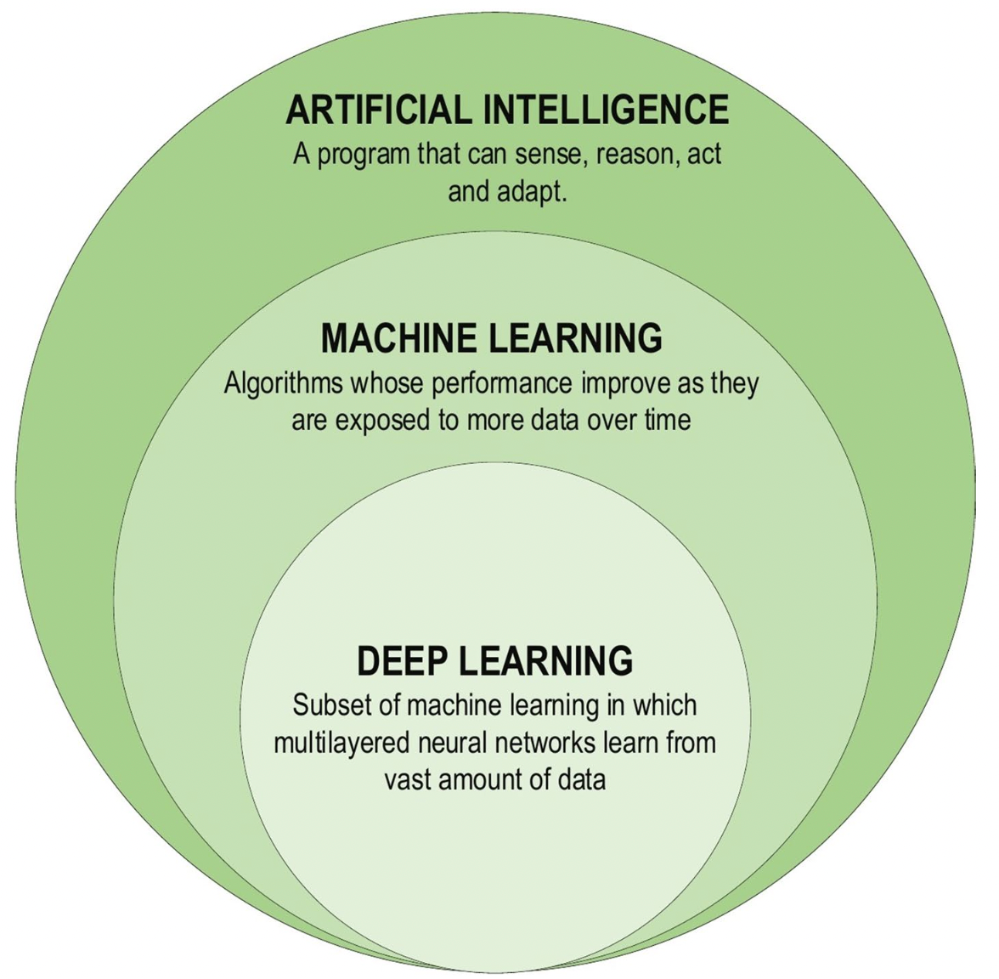
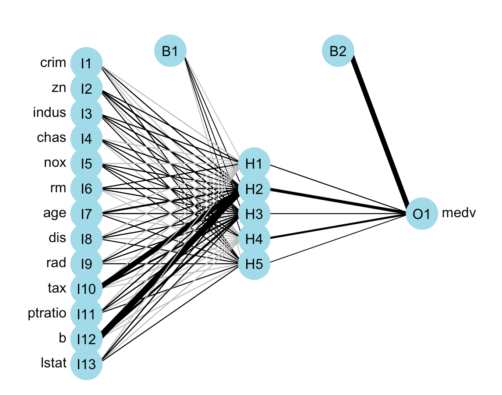
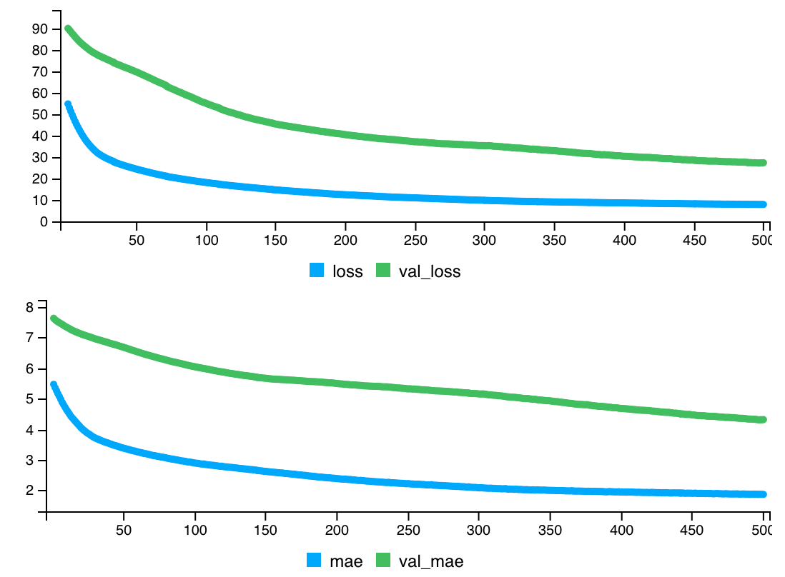
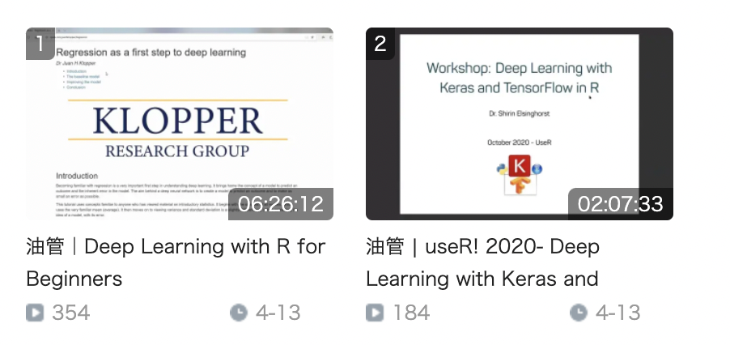
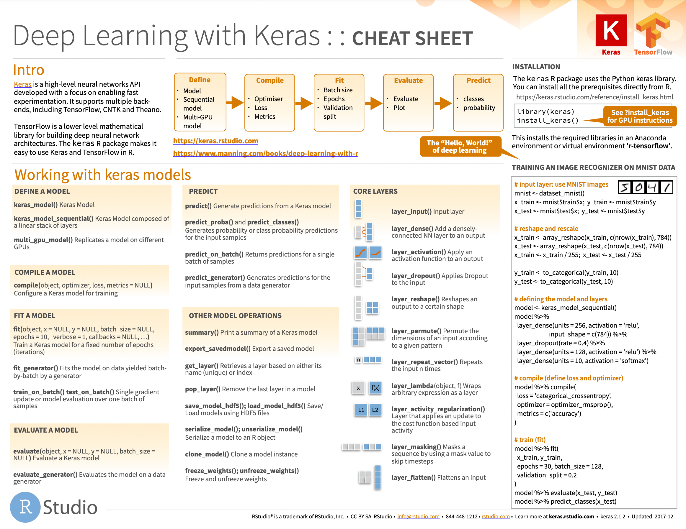
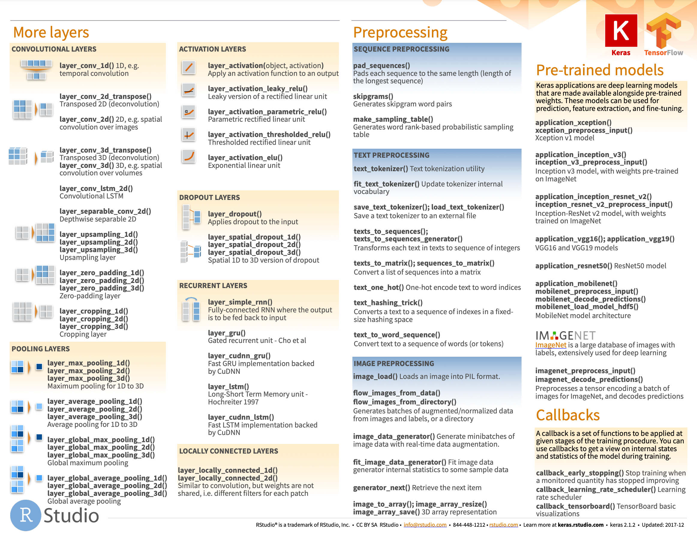

```{r setup, include=FALSE}
knitr::opts_chunk$set(echo = TRUE,warning = F,message = F)
```

## 框架

-   什么是深度学习？
-   为什么选择 R 语言做深度学习？
-   如何搭建工作环境？
-   如何使用神经网络模型？
-   相关资料分享

## 简介

### 什么是深度学习？

深度学习是机器学习领域一个新的研究方向，通过模型模拟人类大脑的神经连接结构，进而给出数据的解释。图 1 给出了人工智能、机器学习和深度学习三者的关系。

深度学习之所以被称为 "深度"，是相对于其他"浅层"学习的方法（支持向量机、提升方法 、最大熵方法等）而言的。浅层学习依靠人工经验抽取样本特征，网络模型学习后获得的单层或双层的特征；而深度学习通过对原始数据进行逐层特征变换，将样本在原空间的特征表示变换到新的特征空间，自动地学习得到层次化的特征表示，从而更有利于分类或特征的可视化。



目前，深度学习已经被应用于诸多领域中，例如：医疗保健、社会网络分析、音频和语音处理（识别和增强）、视觉数据处理方法（多媒体数据分析和计算机视觉）、自然语言处理（翻译和句子分类）等。

### 为什么选择 R 语言做深度学习？

随着 R 的不断发展，利用 R 进行深度学习比以往更容易。并且 R 易学易用，不要求很扎实的编程基础，如今它被广泛地应用于机器学习实践和教学中。即使对 R 语言不是很了解的用户也可以通过一些包来搭建深度学习网络。

## 配置工作环境

在使用 R 进行深度学习前，需要在系统上安装以下东西：

-   R 和 RStudio
-   TensorFlow
-   Keras

> 本文默认读者为 R 语言爱好者，已经安装好了 R 和 RStudio。并且 Anaconda 的[安装](https://www.anaconda.com/products/individual#Downloads)，也不将在本文介绍，需要读者自行解决。

-   安装 TensorFlow 包：

<!-- -->

    install.packages("tensorflow")

如果在上一步中尚未安装 Anaconda，此时将被要求安装 Miniconda。 读者需要接受并等待所有软件包安装。

-   使用 `install_tensorflow()` 函数安装 TensorFlow。

<!-- -->

    library(tensorflow)
    install_tensorflow()

-   确认是否安装成功：

<!-- -->

    library(tensorflow)
    tf$constant("Hellow Tensorflow")
    ## tf.Tensor(b'Hellow Tensorflow', shape=(), dtype=string)

此时，默认安装了适用于 R 的 TensorFlow 版本。

-   安装并加载 keras 包：

<!-- -->

    install.packages('keras')
    library(keras)
    install_keras()

默认安装 CPU 版本的 Keras。如果需要安装 GPU 版本，则应使用此命令：

    install_keras(tensorflow = 'gpu')

-   确认是否安装成功：

<!-- -->

    packageVersion('keras')
    packageVersion('tensorflow')

当工作环境搭建完毕后，就可以开始利用 R 语言做深度学习了。

## 简单案例入门

本节将从一个简单的[回归例子](https://github.com/fmmattioni/deep-learning-with-r-notebooks/blob/master/notebooks/3.6-predicting-house-prices.Rmd)来介绍如何在 R 中使用 keras 包进行深度学习。

知识点包括：

1.  数据导入与数据处理。
2.  构建神经网络。
3.  训练神经网络。
4.  评估模型的准确性。
5.  保存并恢复创建的模型。

### 加载包

```{r}
library(keras)
library(mlbench) #使用内部数据
library(dplyr)
library(magrittr)
library(NeuralNetTools)#神经网络可视化
library(nnet)
```

### 加载数据

使用 1970 年波士顿 506 个人口普查区的住房数据作为例子。该数据集一共有14列，506 行。其中，因变量为 medv（自有住房的中位数报价, 单位 1000 美元），自变量为其他 13 个变量，包括：CRIM （城镇人均犯罪率）、ZN（占地面积超过 25000 平方英尺的住宅用地比例）、INDUS （每个城镇非零售业务的比例）等。

```{r}
data("BostonHousing")
data <- BostonHousing
data %<>% mutate_if(is.factor, as.numeric)
knitr::kable(head(data[,1:12]))
```

### 神经网络可视化

在模型搭建前，可以使用 [NeuralNetTools](https://rdrr.io/cran/NeuralNetTools/man/plotnet.html) 包中的 `plotnet()` 函数绘制网络结构。当然也可以使用其他包，例如：[neuralnet](https://github.com/bips-hb/neuralnet)、[tensorboard](https://tensorflow.rstudio.com/tools/tensorboard/tensorboard/)。

```{r results='hide'}
n <- nnet(medv ~ .,data = data,size = 5)
plotnet(n)  
```



### 数据处理

首先，对 506 条数据进行划分。随机选择其中的 70% 数据作为训练样本，另外 30% 数据作为测试样本。

```{r}
# 构建矩阵
data <- as.matrix(data)
dimnames(data) <- NULL

# 数据集划分
set.seed(1234)
ind <- sample(2, nrow(data), replace = T, prob = c(.7, .3))
training <- data[ind==1,1:13]
test <- data[ind==2, 1:13]
trainingtarget <- data[ind==1, 14]
testtarget <- data[ind==2, 14]
```

此外，由于各个特征的数据范围不同，直接输入到神经网络中，会让网络学习变得困难。所以在进行网络训练之前，先将该数据集进行特征标准化：输入数据中的每个特征，将其减去特征平均值并除以标准差，使得特征值以 0 为中心，且具有单位标准差。在 R 中可以使用 `scale()` 函数实现该效果。

> 数据集 BostonHousing 也可以直接通过 keras 包中的 `dataset_boston_housing()` 进行加载，并且已经提前划分好了训练集和测试集。本文使用的是 mlbench 包中数据集进行加载，主要是呈现划分数据集的过程。

```{r}
# 数据标准化
m <- colMeans(training)
s <- apply(training, 2, sd)
training <- scale(training, center = m, scale = s)
test <- scale(test, center = m, scale = s)
```

### 构建模型

由于可用样本量很少，这里构建一个非常小的网络。使用 `keras_model_sequential()` 定义模型，并设置了 1 个隐藏层和 1 个输出层。激活函数为 relu。

```{r}
model <- keras_model_sequential() %>% 
         layer_dense(units = 10, activation = 'relu', input_shape = c(13)) %>%
         layer_dense(units = 1)
```

通过 `summary()` 查看模型个层形状和参数，可以看到，总共包含 151 个参数。

```{r}
summary(model)
```

### 编译模型

使用 mse 损失函数 ------均方误差编译网络，即预测和目标之间差异的二次方。这是回归问题广泛使用的损失函数。使用 mae ------平均绝对误差来监控网络。优化器为 rmsprop。

```{r}
model %>% compile(loss = 'mse',
                  optimizer = 'rmsprop',
                  metrics = 'mae')
```

### 拟合模型

拟合模型时，RStudio 的 Viewer 会出现：随着迭代变化的损失函数值。如下所示：

```{r}
mymodel <- model %>%
         fit(training,
             trainingtarget,
             epochs = 200,
             batch_size = 32,
             validation_split = 0.2)
```



图中的 loss 是指损失函数，val_loss 是指验证集下的损失函数（代码中设置的验证集划分比例为 0.2）。 mae 表示平均绝对误差，而 val_mae 表示验证集下的平均绝对误差。图中可以看到，随着训练轮数的增加，mae 与 loss 在不断减小并趋于稳定。

### 评估模型

使用 `evaluate()` 评估模型，给出预测结果。计算真实值和预测值的均方误差。

```{r}
model %>% evaluate(test, testtarget)
pred <- predict(model,test) #预测结果
mean((testtarget-pred)^2) #计算均方误差
```

通过 [ggplot2](https://ggplot2.tidyverse.org/) 包将预测结果和真实结果可视化。

```{r}
library(ggplot2)
library(viridis)
library(ggsci)
ev_data = data.frame("Item" = seq(1,length(pred)),
                     "Value" = c(testtarget,pred),
                     "Class" = rep(c("True","Pred"),each = length(pred)))
ggplot(ev_data) +
  geom_line(aes(Item,Value,col = Class,lty = Class)) +
  scale_color_aaas() +
  theme_bw() + 
  theme(panel.grid = element_blank())
```

总体来看，预测结果还算不错，但是也有一些预测结果和真实值相差甚远。主要原因是，我们没有调整参数来使模型达到最优的效果。读者可以使用 K 折验证的方法来寻找最有的参数，例如：训练轮数，神经网络层数，各层神经元数等。具体案例可以见 《Deep Learning with R》的第 [3.6.4 节](https://github.com/fmmattioni/deep-learning-with-r-notebooks/blob/master/notebooks/3.6-predicting-house-prices.Rmd)。

### 存储/加载模型

为了保存 Keras 模型以供未来使用，使用 `save_model_tf()` 函数保存模型。加载模型使用 `load_model_tf()` 函数。

```{r eval=FALSE, include=TURE}
save_model_tf(object = model, filepath = "model") #保存模型
reloaded_model <- load_model_tf("model") #加载模型
```

## 相关拓展

以上例子介绍了如何使用神经网络来处理简单问题（数据量较小的回归问题），但在实际过程中可能面临种种困难，包括：如何对数据进行预处理，如何进行特征筛选，如何解决过拟合问题，如何调整参数等。

由于笔者时间和能力有限，这篇推文不能一一给出系统的解决方案。下面给出一些相关资源以供读者翻阅。

> 该系列还会继续写下去，欢迎来我的公众号《庄闪闪的 R 语言手册》关注新内容。

### 相关教程

1.  RStudio 官网 tensorflow [资料](https://tensorflow.rstudio.com/) 和 AI 相关 [博客](https://blogs.rstudio.com/ai/);

2.  书籍：[《Deep Learning with R》](https://www.manning.com/books/deep-learning-with-r)，对应 [代码](https://github.com/fmmattioni/deep-learning-with-r-notebooks)，[中文翻译版本](https://item.jd.com/13183476.html)。

3.  入门教程：[keras: R 语言中的深度学习](https://www.datacamp.com/community/tutorials/keras-r-deep-learning)；

4.  基于 Keras 和 TensorFlow 的深度学习的 [研讨会](https://github.com/rstudio-conf-2020/dl-keras-tf)；

5.  相关视频

    1.  [基于R语言的深度学习：针对入学者](https://www.youtube.com/watch?v=xzbVK2tqTfM&t=11978s)；
    2.  Shirin 在 2020 年 R 会议的报告：[《基于R语言的深度学习》](https://www.youtube.com/watch?v=uBISMeExoqk)，[会议笔记](https://gitlab.com/ShirinG/keras_tutorial_user2020)。

> 防止读者加载不了视频，作者已将其搬运到 B 站 [(1)](https://www.bilibili.com/video/BV1E3411n7Ry/)， [(2)](https://www.bilibili.com/video/BV1W34y1v795/?spm_id_from=333.788)，仅供大家学习使用。



6.  RStudio 官方给出的 Keras [速查表](https://raw.githubusercontent.com/rstudio/cheatsheets/main/keras.pdf)





### 相关案例

- [R 中使用 TensorFlow Probability](https://blogs.rstudio.com/ai/posts/2019-01-08-getting-started-with-tf-probability/)
- [表示学习](https://blogs.rstudio.com/ai/posts/2018-10-22-mmd-vae/#our-objective-today)
- [几何深度学习](https://blogs.rstudio.com/ai/posts/2021-08-26-geometric-deep-learning/)
- [基于空间预测的卷积 LSTM 网络](https://blogs.rstudio.com/ai/posts/2020-12-17-torch-convlstm/)
