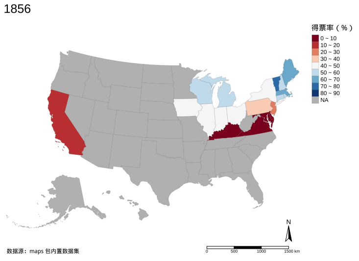

```{css}
#| echo: false

.sidebar {
  border: 1px solid #ccc;
  border-left-width: 5px;
  border-radius: 5px;
  padding: 1em;
  margin: 1em 0;
}

div.img, div.figure {
  text-align: center;
  display: block; 
  margin-left: auto; 
  margin-right: auto;
}
```
```{css}
#| echo: false

/* https://github.com/rstudio/bookdown/blob/main/inst/templates/default.html#L89-L113 */
/* Used with Pandoc 2.11+ new --citeproc when CSL is used */
div.csl-bib-body { }
div.csl-entry {
  clear: both;
}
.hanging div.csl-entry {
  margin-left: 2em;
  text-indent: -2em;
}
div.csl-left-margin {
  min-width: 2em;
  float: left;
}
div.csl-right-inline {
  margin-left: 1em;
  padding-left: 1em;
}
div.csl-indent {
  margin-left: 1em;
}
```


```{r}
#| label: setup
#| echo: false

knitr::opts_chunk$set(
  comment = "#",
  message = FALSE,
  cache = FALSE,
  echo = TRUE,
  collapse = TRUE
)
```

# 本文概览 {#motivation}


在[《地区分布图及其应用》](https://cosx.org/2022/05/choropleth-map/)一文中收到读者反馈，内容多，读得累。地区分布图的制作过程介绍不详细，对新手不友好，下面还是以地区分布图为例，在一个更加简单的数据集上，**详细**介绍用 **ggplot2** 包制作的过程。主要包含以下几个部分：

1. 软件准备：简单介绍制作地区分布图及其动画所需的 R 包。
1. 制作地图：详细介绍绘图涉及的数据处理和可视化过程。
1. 制作动画：介绍 GIF 动画和 Web 动画两种展示形式。
1. 本文小结：总结归纳数据处理和绘图的主要步骤。


# 软件准备 {#setup}

本文介绍如何使用 R 语言制作动态地区分布图，主要使用的扩展包有：

1. **maps** 包[@Becker1993]：提供 votes.repub 数据集 --- 记录 1856-1976 年美国历届大选中共和党在各州的得票率，还提供一份过时的美国州级多边形边界地图数据 state。

1. **mapproj** 包[@mapproj]：内置各种常用的坐标投影，支撑 **ggplot2** 包制作地图。

1. **ggplot2** 包[@Wickham2022]：将 **maps** 包内置的美国州级地图数据 state 从 map 类型转化为 data.frame 类型，然后绘制地图，同时设置坐标投影。

1. **tigris** 包[@tigris]：获取和处理美国人口调查局发布的州级多边形边界地图数据。

1. **sf** 包[@Pebesma2018]：读取和处理空间数据，并支撑 **ggplot2** 包制作地图。

1. **gifski** 包[@gifski]：将一张张静态图片合成 GIF 动图，**gganimate** 包和 **tmap** 包都需要它来导出 GIF 动图。

1. **showtext** 包[@Qiu2015]：用 **tmap** 包制作含中文的 GIF 动画，需要**showtext** 包的支持。

1. **ragg** 包[@ragg]：用 **gganimate** 包制作含中文的 GIF 动画，需要 **ragg** 包的支持，**showtext** 包暂不支持此场景。

1. **gganimate** 包[@gganimate]：提供一套动态图形语法，动画制作与 **ggplot2** 绘图衔接得如丝般顺滑。

1. **tmap** 包[@Tennekes2018]：用来制作地区分布图，导出 GIF 动画，尽管功能远不止于此。

1. **echarts4r** 包[@echarts4r]：用来制作地区分布图，生成 Web 动画。

读者可以通过下面的代码一次性把上面的 R 包都安装上：

```{r}
#| eval: false
#| echo: true
install.packages(c(
  "maps", "mapproj", "ggplot2", "tigris",
  "sf", "gifski", "showtext", "ragg", 
  "gganimate", "tmap", "echarts4r"
))
```

# 制作地图 {#make-maps}

## 地区分布图 {#choropleth-map}

### 数据准备

首先加载 **maps** 包，方便后续读取其内置的美国共和党大选数据集 votes.repub 和美国州级地图数据集 state。


```{r}
library(maps)
```


加载数据集 votes.repub，并查看数据类型和部分数据。

```{r}
# 加载数据
data(votes.repub)
# 查看数据
str(votes.repub)
```

votes.repub 是一个 50 行 31 列的矩阵，行代表各州，列代表大选年份，进一步查看矩阵数据 votes.repub 的维度信息：

```{r}
attributes(votes.repub)
```

数据 votes.repub 是 matrix 矩阵类型，为方便后续数据操作，先转化为 data.frame 类型。

```{r}
# 转为 data.frame 类型
votes_repub <- as.data.frame(votes.repub)
```

根据数据集 votes.repub 的行名生成两列是为了后续和地图数据集 state 做关联，最终将观测数据映射到地图上。state 列可与 `ggplot2::map_data()` 生成的地图数据合并，state_name 列可与 **tigris** 包获取的数据合并。

```{r}
# 新增 state 和 state_name 列
votes_repub = within(votes_repub, {
  state_name = rownames(votes_repub)
  state = tolower(rownames(votes_repub)) # 州名转小写
})
```

::: sidebar
需要什么格式的州名取决于所能获得的地图数据，一般需要对地图数据有所了解后才能知晓。
:::


接下来是非常重要的一步数据操作：数据重塑。顾名思义，就是将数据集重新组织起来，是为了方便后续用 **ggplot2** 等包绘图。

```{r}
# 重塑 votes_repub 数据集
us_votes_repub <- reshape(
  data = votes_repub,
  # 需要转行的列，列名构成的向量
  varying = as.character(seq(1856, 1976, by = 4)),
  times = as.character(seq(1856, 1976, by = 4)), # 构成新列 year 的列值
  v.names = "repub_prop", # 列转行 列值构成的新列，指定名称
  timevar = "year", # 列转行 列名构成的新列，指定名称
  idvar = "state", # 州名
  new.row.names = 1:(31 * 50),
  direction = "long"
)
# 查看重塑后的数据集 us_votes_repub 
head(us_votes_repub)
```

不难看出，数据集 us_votes_repub 不是很完整，一些历史的大选，有些州没有记录。下面统计一下历届大选中数据缺失的情况，如图\@ref(fig:votes-repub-na)所示。阿拉斯加州和夏威夷州是 1959 年正式加入美国的，之前只是美国的领地，没有资格参与美国的大选。

```{r}
us_votes_repub_na <- aggregate(
  data = us_votes_repub,
  state ~ year,
  subset = is.na(repub_prop),
  FUN = length
)
```
```{r}
#| label: votes-repub-na
#| fig.cap: "历届大选未收集到得票率数据的州有多少"
#| fig.align: "center"
#| echo: false
#| fig.width: 6
#| fig.height: 4
#| dev: "ragg_png"

us_votes_repub_na$year <- as.integer(us_votes_repub_na$year)
library(ggplot2)

ggplot(data = us_votes_repub_na, aes(x = year, y = state)) +
  geom_line() +
  scale_x_continuous(n.breaks = 10) +
  scale_y_continuous(n.breaks = 10) +
  theme_minimal(base_family = "Noto Serif CJK SC") +
  labs(x = "年份", y = "州数")
```

接下来，先挑一个年份的大选数据，绘制一张静态的地区分布图，不妨以 1976 年的数据为例：

```{r}
us_votes_repub_1976 <- subset(x = us_votes_repub, subset = year == "1976")
```

**ggplot2** 包[@Wickham2022] 是基于数据框来作图的，地图也不例外，因此，需要先对 **maps** 包内置的 state 数据集做转化，**ggplot2** 包的 `map_data()` 函数可将 **maps** 包和 **mapdata** 包内置的 map 类型地图数据转化为 data.frame 类型地图数据。 

```{r}
library(ggplot2)
# 获取州级地图数据
usa_map <- map_data(map = "state")
```

map 类型的 state 数据集转化后，如下：

```{r}
head(usa_map)
```

每一对经度 long 和纬度 lat 对应州的多边形边界上的一个点，按一定顺序 order 连接起来，就能围成一个多边形区域 region， 即州的行政区划边界，usa_map 是州级地图数据，不包含各郡的边界，故而 subregion 列都缺失。

接着，将观测数据以左关联的方式合并到地图数据上。注意将地图数据放左边，观测数据放右边，左侧地图数据最好不要含有缺失值，右侧观测数据并不完整。

```{r}
# 合并观测数据和地图数据
usa_voting_df <- merge(
  x = usa_map,
  y = us_votes_repub_1976,
  by.x = "region", # region 首字母小写的各州名称
  by.y = "state",
  all.x = TRUE,
  sort = FALSE
)
```

地图上的每个区域都是有编号顺序的，不能乱，上面合并数据的操作打乱了地图数据的原有顺序，因此，需要恢复一下顺序，重新按照序号 order 列排序，否则地图是乱的，读者可试试看不排序的效果。

```{r}
usa_voting_df <- usa_voting_df[order(usa_voting_df$order), ]
```

### 数据展示

经过上面一系列的数据操作，终于到画图的环节了。与普通的图形不同，绘制地图需要注意底图和坐标投影，**ggplot2** 提供 `geom_map()` 和 `coord_map()` 两个函数实现相应配置。如图\@ref(fig:usa-geom-map)所示，是一张根据 **maps** 包内置的北美州级地图数据生成的多边形区域填充图，灰黑色填充各州区域，浅灰色绘制各州边界。

```{r}
#| label: usa-geom-map
#| fig.cap: "北美州级地图"
#| fig.width: 7
#| fig.height: 5
#| cache: true
#| fig.align: "center"
#| fig.showtext: true

ggplot(data = usa_voting_df, aes(long, lat, group = subregion)) +
  geom_map(
    map = usa_map, aes(map_id = region),
    color = "gray80", fill = "gray30", size = 0.3
  )
```

接着，设置坐标投影。**maps** 包内置的 state 数据集，其经纬度坐标来自常见 [WGS 84](https://epsg.io/4326) 参考系，即所谓的世界大地测量系统 World Geodetic System，于 1984 制定，全球定位系统 GPS 即采用此坐标参考系。

为了在二维地图上更加形象地体现地球的球型特点，利用 **mapproj** 包采用以北级为中心的方位角投影，平行线是同心圆，经线是等距径向线，详细描述见帮助文档`?mapproj::mapproject`，效果如图\@ref(fig:usa-coord-map)。

```{r}
#| label: usa-coord-map
#| fig.cap: "北美州级地图"
#| fig.width: 6
#| fig.height: 3.5
#| cache: true
#| fig.align: "center"
#| fig.showtext: true

ggplot(data = usa_voting_df, aes(long, lat, group = subregion)) +
  geom_map(
    map = usa_map, aes(map_id = region),
    color = "gray80", fill = "gray30", size = 0.3
  ) +
  coord_map(
    projection = "orthographic",
    orientation = c(latitude = 39, longitude = -98, rotation = 0)
  )
```

接着，利用多边形图层 `geom_polygon()` 添加共和党得票率数据，填充颜色采用红蓝对比色。最后，设置极简主题去掉灰色背景，添加主标题、图例标题，设置字体样式。

```{r}
#| label: votes-repub-map
#| fig.cap: "1976年共和党在各州的得票率"
#| fig.width: 6.667
#| fig.height: 4.667
#| cache: true
#| fig.align: "center"
#| fig.showtext: true
#| echo: false

ggplot(data = usa_voting_df, aes(long, lat, group = subregion)) +
  geom_map(
    map = usa_map, aes(map_id = region),
    color = "gray80", fill = "gray30", size = 0.3
  ) +
  coord_map("orthographic", orientation = c(39, -98, 0)) +
  geom_polygon(aes(group = group, fill = repub_prop / 100), color = "black") +
  scale_fill_gradient2(
    low = "blue", mid = "white", high = "red",
    midpoint = 0.5, labels = scales::label_percent()
  ) +
  theme_minimal() +
  labs(
    title = "1976 年共和党在各州的得票率",
    x = "", y = "", fill = "得票率"
  ) +
  theme(
    plot.title = element_text(size = 16, face = "bold", color = "red3"),
    legend.position = "bottom"
  )
```

<details>
<summary> 显示代码 </summary>
```{r}
#| ref.label: votes-repub-map
#| eval: false
#| echo: true
```
</details>

实际上，1976 年的大选，共和党在阿拉斯加和夏威夷是有得票数据的，因 **maps** 包内置的 state 地图数据集缺少这两个州，所以上图 \@ref(fig:votes-repub-map) 未能展示，因此，要从美国人口调查局获取完整的地图数据。另外，图中还缺少北纬/南纬、东经/西经的方向指示。因此，接下来采用 **sf** 包加强的 **ggplot2** 来制作更加完善的地图。

[Kyle Walker](https://walker-data.com/) 开发的 **tigris** 包封装了地图数据的下载接口，下面获取 2019 年发布的比例尺为 1:20000000 的州级地图数据，并将阿拉斯加州、夏威夷州和波多黎各适当移动至连续的 48 州下方。

```{r}
#| eval: false

us_state_map <- tigris::states(cb = T, year = 2019, resolution = "20m", class = "sf")
# 移动离岸的地区
us_state_map <- tigris::shift_geometry(us_state_map, geoid_column = "GEOID", position = "below")
```
```{r}
#| echo: false

library(sf)
us_state_map <- readRDS(file = "data/us_state_map.rds")
```

下载整理后保存到本地文件 `us_state_map.rds`，先查看下地图数据情况。

```{r}
us_state_map
```

地图数据的坐标参考系是 [USA Contiguous Albers Equal Area Conic](https://epsg.io/102003)，感兴趣读者可以点开网页链接了解技术细节。一个州可能有多个独立的地区，比如夏威夷群岛，因此 Geometry 类型是 MULTIPOLYGON 而不是简单的 POLYGON。NAME 列表示各州或领地名称。图 \@ref(fig:usa-state-map) 是这份地图数据的效果图，图中阿拉斯加以一定比例缩小了，而夏威夷和波多黎各以一定比例放大了。

```{r}
#| label: usa-state-map
#| fig.cap: "美国州级地图"
#| echo: false
#| fig.align: "center"

par(mar = c(0, 0, 0, 0))
plot(st_geometry(us_state_map))
```


地图数据有了后，类似之前的操作，将观测数据以左关联的方式合并到地图数据上。


```{r}
usa_voting_map_1976 <- merge(
  x = us_state_map,
  y = us_votes_repub_1976,
  by.x = "NAME", 
  by.y = "state_name", 
  all.x = TRUE
)
```

在 sf 包的加持下，地理几何图层 `geom_sf()` 可以替代 `geom_map()`，坐标投影图层 `coord_sf()` 可以替代 `coord_map()`。整个绘图的过程极大地简化下来了，核心部分只有两行，如下：

```{r}
#| echo: true
#| eval: false

ggplot() +
  geom_sf(data = usa_voting_map_1976, aes(fill = repub_prop / 100))
```

最后，添加颜色映射和主题等细节，如图\@ref(fig:votes-repub-sf)所示。

```{r}
#| label: votes-repub-sf
#| fig.cap: "1976年共和党在各州的得票率"
#| fig.width: 6.5
#| fig.height: 4.5
#| cache: true
#| fig.showtext: true
#| fig.align: "center"
#| echo: false

ggplot() +
  geom_sf(data = usa_voting_map_1976, aes(fill = repub_prop / 100)) +
  scale_fill_gradient2(
    low = "blue", mid = "white", high = "red",
    midpoint = 0.5, labels = scales::label_percent()
  ) +
  theme_minimal() +
  labs(
    title = "1976 年共和党在各州的得票率",
    x = "", y = "", fill = "得票率"
  ) +
  theme(
    plot.title = element_text(size = 16, face = "bold", color = "red3"),
    legend.position = "bottom"
  )
```

<details>
<p><summary> 显示代码 </summary></p>
```{r}
#| ref.label: votes-repub-sf
#| eval: false
#| echo: true
```
</details>


# 制作动画 {#make-animations}

本节介绍两种动画形式 GIF 动画和 Web 动画，在上一节介绍的地区分布图基础上，让地图动起来，连续展示共和党在 31 次美国大选中的得票率分布。

## GIF 动画 {#gif-animations}

GIF 动图是一种制作起来非常简单的动画，其实质是将一张张静态图片以适当顺序连续播放，因人眼视觉残留带来连续的效果。下面介绍 R 语言社区两个非常流行的制作 GIF 动图的扩展包：**gganimate** 包和 **tmap** 包。

### gganimate 包

[Thomas Lin Pedersen](https://www.data-imaginist.com/) 从 [David Robinson](http://varianceexplained.org/) 接手维护**gganimate**后，大刀阔斧地开发，试图打造一套动态图形语法「A Grammar of Animated Graphics」，让 [**gganimate**](https://github.com/thomasp85/gganimate) 和 **ggplot2** 无缝衔接。与之前类似，先做些数据准备的操作：

```{r}
# 将历届大选数据与地图数据合并
usa_voting_map <- merge(
  x = us_state_map,
  y = us_votes_repub,
  by.x = "NAME", 
  by.y = "state_name", 
  all.x = TRUE
)
# year 为 NA 表示没有波多黎各的观测数据，可以去掉
usa_voting_map <- subset(x = usa_voting_map, subset = !is.na(year))
# year 作为转场时间变量，需要转为整型
usa_voting_map$year <- as.integer(usa_voting_map$year)
```

从 1856 年到 1976 年，美国共经历 31 次大选，设置总帧数 31，每秒播放 1 帧，最终生成逐帧动画。

```{r}
options(gganimate.nframes = 31, gganimate.fps = 1)
```

[Gifski](https://gif.ski/) 是一个制作 GIF 动图的 Rust 库，[Jeroen Ooms](https://github.com/jeroen) 将其引入 R 语言社区，开发了同名的 R 包 [**gifski**](https://github.com/r-rust/gifski)，它用于合成 GIF 动图或 MP4 格式视频。

将 **ggplot2** 制作的静态图形转化为 **gganimate** 制作的 GIF 动图，只需再加一行代码，指定转场的时间变量。

```{r}
#| eval: false

transition_time(year)
```


最终效果如图\@ref(fig:votes-repub-gganimate)所示。

```{r}
#| label: votes-repub-gganimate
#| fig.cap: "1856-1976年共和党在各州的得票率"
#| fig.width: 6
#| fig.height: 4.5
#| dev: "ragg_png"
#| fig.align: "center"
#| cache: true
#| echo: false

library(gganimate)
ggplot() +
  geom_sf(data = usa_voting_map, aes(fill = repub_prop / 100)) +
  scale_fill_gradient2(
    low = "blue", mid = "white", high = "red",
    midpoint = 0.5, labels = scales::label_percent()
  ) +
  theme_minimal() +
  theme(
    plot.title = element_text(
      size = 16, face = "bold",
      color = "red3", family = "Noto Serif CJK SC"
    ),
    legend.position = "bottom"
  ) +
  labs(
    title = "{frame_time} 年美国大选共和党得票率",
    x = "", y = "", fill = ""
  ) +
  transition_time(year)
```

<details>
<p><summary> 显示代码 </summary></p>
```{r}
#| ref.label: votes-repub-gganimate
#| eval: false
#| echo: true
```
</details>

GIF 动图制作过程中有几点需要注意：

1.  调整总帧数和帧率，在图\@ref(fig:votes-repub-gganimate)基础上添加过渡效果，需要额外安装 **transformr** 包，它是通过插值的方式实现中间过渡状态的。

1.  GIF 动图\@ref(fig:votes-repub-gganimate) 是逐年逐帧显示得票率分布，不需要添加过渡效果，美国大选每四年一届，插值后会很奇怪，但可以调整帧率，即每秒播放地区分布图的幅数。

1.  **showtext** 包支持在 **ggplot2** 绘制的图形中添加中文字体，但是不支持 **gganimate** 包的动画制作场景。因此，安装 **ragg** 包，在生成 GIF 图\@ref(fig:votes-repub-gganimate)的代码块选项中，图形设备设置为 `dev = "ragg_png"`。为操作系统安装 [Noto Serif CJK SC 字体](https://github.com/googlefonts/noto-cjk)，并设置为图中标题字体。

1. 在标题处添加了年份，这样就知道每一帧动画对应的大选之年。


###  tmap 包

[**tmap**](https://github.com/r-tmap/tmap) 包功能丰富，支持多种图形展示各种空间数据，如比例符号图（Proportional symbol map）、地区分布图（Choropleth map）、等值线图（Isopleth or contour map）、分类图（Categorical map）、核密度图（Kernel density map）和变形图（Cartogram）等，支持网页展示交互地图、导出高质量图片，借助 **gifski** 包支持导出时空 GIF 动画等，还可在于 Shiny 应用中交互展示空间数据。

本小节参考了《Geocomputation with R》[@Lovelace2022]第 9 章第 3 节[动态地图](https://geocompr.robinlovelace.net/adv-map.html#animated-maps)的内容来制作 GIF 动态地图。**tmap** 制作地图的代码风格和 **ggplot2** 非常类似，相信理解起来不难。

```{r}
#| label: votes-repub-tmap
#| fig.cap: "1976年共和党在各州的得票率"
#| fig.align: "center"
#| fig.width: 11
#| fig.height: 8
#| cache: true
#| fig.showtext: true
#| echo: false

library(tmap)
tm_shape(usa_voting_map_1976) + 
  tm_polygons(
    col = "repub_prop",    # 数据列
    palette = "RdBu",      # 调色板
    border.alpha = 0.2,    # 边界线透明度
    title = "得票率（%）", # 图例标题
    breaks = 10 * 0:9,     # 得票率分段
    colorNA = "gray",      # 表示缺失数据的填充色
    textNA = "NA"          # 表示缺失数据的文本
  ) +
  tm_compass(type = "4star", position = c("left", "top")) + # 指北针
  tm_scale_bar(position = c("right", "bottom"), text.size = 1) + # 比例尺
  tm_credits(text = "数据源：maps 包内置数据集", position = "left", size = 1) + # 版权信息
  tm_layout(
    main.title = "1976年共和党在各州的得票率", # 全局标题
    main.title.size = 1.5, # 全局标题大小
    main.title.position = c("center", "top"), # 全局标题位置
    legend.text.size = 1.0,  # 图例文本大小，相对值
    legend.title.size = 1.2, # 图例标题大小，相对值
    legend.outside = TRUE,   # 图例置于绘图区域外部
    legend.outside.position = "right", # 图例位于右侧
    legend.outside.size = 0.15, # 图例占宽度
    legend.format = list(text.separator = "~"), # 图例中文本分割线
    outer.margins = 0, # 取消外边空
    asp = 0, # 图形横纵比根据设备定
    frame = FALSE # 取消边框
  )
```

<details>
<p><summary> 显示代码 </summary></p>
```{r}
#| ref.label: votes-repub-tmap
#| eval: false
#| echo: true
```
</details>

与前面用 **gganimate** 制作 GIF 动画类似，**tmap** 包制作 GIF 动画也需要预先安装 R 包 **gifski**，也只需替换历届大选数据，增加 3-5 行代码而已。

```{r}
#| eval: false
#| echo: true

# year 表示时间轴，固定坐标系
tm_facets(along = "year", free.coords = FALSE)
```

再用函数 `tmap_animation()` 导出指定格式的动态图形，GIF 图\@ref(fig:usa-voting-tmap-anim) 的设置如下：

```{r}
#| eval: false
#| echo: true

tmap_animation(usa_voting_anim,
  filename = "usa_voting_anim.gif",
  width = 1100/1.5, height = 800/1.5, delay = 50
)
```

其中，参数 `height` 和 `width` 分别表示图片的长和宽（以像素计），`delay` 参数表示两帧画面转场的时间间隔（以 1/100 秒计），`delay = 50` 意味着间隔时间为 0.2 秒。

{.full}

<details>
<p><summary> 显示代码 </summary></p>
```{r}
#| eval: false
#| fig.showtext: true

library(tmap)
usa_voting_anim <- tm_shape(usa_voting_map) +
  tm_polygons(
    col = "repub_prop",
    palette = "RdBu",
    border.alpha = 0.2,
    title = "得票率（%）",
    breaks = 10 * 0:9,
    colorNA = "gray",
    textNA = "NA"
  ) +
  tm_compass(position = c("right", "bottom")) +
  tm_scale_bar(position = c("right", "bottom")) +
  tm_credits(text = "数据源：maps 包内置数据集", position = "left") +
  tm_layout(
    legend.outside = TRUE,
    legend.outside.position = "right",
    legend.outside.size = 0.15,
    legend.format = list(text.separator = "~"),
    outer.margins = 0,
    asp = 0, frame = FALSE
  ) +
  tm_facets(along = "year", free.coords = FALSE)
# 制作动画
tmap_animation(usa_voting_anim,
  filename = "usa_voting_anim.gif",
  width = 1100/1.5, height = 800/1.5, delay = 50
)
```
</details>


## Web 动画 {#web-animations}

### echarts4r 包

[**echarts4r**](https://github.com/JohnCoene/echarts4r)[@echarts4r] 是 JavaScript 库 [Apache ECharts](https://echarts.apache.org/en/) 的 R 语言接口。截止写作时间，**echarts4r** 包内置的 Apache ECharts 更新到 **5.3.2** 版本，已经支持很多 Apache ECharts 的功能，一篇写给初学者的入门文章参见[《echarts4r: 从入门到应用》](https://cosx.org/2021/12/introduction-to-echarts4r/)，本节的地图动画是原文暂未涉及的应用案例。

在制作交互式的地图动画之前，先从 Github 下载 [**echarts4r.maps**](https://github.com/JohnCoene/echarts4r.maps) 包，它内置一份 GeoJSON 格式的美国州级地图数据。

```{r}
#| eval: false

remotes::install_github('JohnCoene/echarts4r.maps')
```

图\@ref(fig:votes-repub-echarts4r-draft) 展示 1856-1976 年美国历届大选中，共和党在各州的得票率变化情况。


```{r}
#| label: votes-repub-echarts4r-draft
#| fig.cap: "1856-1976 年美国历届大选中共和党在各州的得票率"
#| fig.align: "center"

library(echarts4r)
library(echarts4r.maps)
us_votes_repub |>
  group_by(year) |>
  e_charts(x = state_name, timeline = TRUE) |>
  em_map(map = "USA") |>
  e_map(serie = repub_prop, map = "USA", name = "得票率（%）") |> 
  e_visual_map(serie = repub_prop) |> 
  e_tooltip()
```

在上图的制作的基础上，还可以定制一些内容：

- 悬浮提示：仍然采用默认的样式，读者可定制一番。稍注意的是在表达百分比时，JS 函数 `Math.round()` 会四舍五入抹去小数点，要想保留两位小数，需要做一点变换 `Math.round(params.value * 100) / 100`。

    ```{r}
    #| eval: false
    e_tooltip(
      formatter = htmlwidgets::JS("
        function(params){
          if(params.value) {
            return('<strong>' + params.name + '</strong>' + 
                   '<br />' + Math.round(params.value * 100) / 100 + '%')
          } else 
            return('数据缺失')
        }
      ")
    )
    ```

    百分数处理参考 [SO 帖子](https://stackoverflow.com/questions/11832914/)，自定义悬浮提示参考[SO 帖子](https://stackoverflow.com/questions/50554304/)。JS 代码中 `params.name` 对应 `e_map()` 函数的 `name` 参数值，`params.value` 对应 `serie` 参数值。但是在气泡图中，有点不一样，以 R 内置的数据集 mtcars 为例，`params.name` 对应 `bind`，`params.value[0]` 对应 `x`， `params.value[1]` 对应 `serie` ，`params.value[2]` 对应 `size`。不同的图形有不同的对应情况，详见 Apache ECharts [官方文档](https://echarts.apache.org/en/option.html#tooltip.formatter)。
    
    ```{r}
    mtcars |>
      tibble::rownames_to_column("model") |>
      group_by(cyl) |> 
      e_charts(x = wt) |>
      e_scatter(serie = mpg, size = qsec, bind = model) |>
      e_tooltip(formatter = htmlwidgets::JS("
              function(params) {
                  return (
                      '<strong>' + params.name + '</strong>' +
                      '<br />wt: ' + params.value[0] +
                      '<br />mpg: ' + params.value[1] +
                      '<br />qsec: ' + params.value[2]
                  )
              }
              "))
    ```
    

- 视觉映射：修改视觉映射上下两端文本，使用红蓝对撞的调色板，置于左下方。有点体现共和党和民主党对垒的意思。

- 主副标题：在图形上方添加动画标题、左下方说明数据来源。在动画场景下，用 `e_timeline_serie()` 实现，非动画场景下，可用 `e_title()` 实现。

- 地图底图：**echarts4r.maps** 包内置的 [GeoJSON](https://geojson.org/) 格式[美国州级地图](https://raw.githubusercontent.com/JohnCoene/echarts4r.maps/master/inst/USA.json)。

- 坐标投影：相比于前面展示的动画，最终效果图\@ref(fig:votes-repub-echarts4r)采用的坐标投影不一样，它是反映实际区域面积大小的。

- 数据映射：注意地图数据中州名 name 字段格式，如阿拉斯加州是 `Alaska` 而不是 `alaska`，这个用于匹配观测数据 `us_votes_repub` 中的 `state_name` 列。

- 动画播放：设置自动播放动画，播放间隔为 1s。

仅从图\@ref(fig:votes-repub-echarts4r)不难看出，共和党在北方比较受欢迎。

```{r}
#| label: votes-repub-echarts4r
#| fig.cap: "1856-1976 年美国历届大选中共和党在各州的得票率"
#| fig.align: "center"
#| echo: false
us_votes_repub |>
  group_by(year) |>
  e_charts(x = state_name, timeline = TRUE) |>
  em_map(map = "USA") |>
  e_map(serie = repub_prop, map = "USA", name = "得票率（%）") |>
  e_visual_map(
    serie = repub_prop,
    left = 80,
    bottom = 40,
    text = c("高", "低"),
    inRange = list(
      color = RColorBrewer::brewer.pal(n = 11, name = "RdBu")
    )
  ) |>
  e_tooltip() |>
  e_timeline_opts(
    autoPlay = TRUE,
    show = TRUE,
    bottom = 20,
    playInterval = 1000
  ) |>
  e_timeline_serie(title = lapply(
    rep("1856-1976 年美国历届大选中共和党在各州的得票率", 31),
    function(title) {
      list(
        text = title,
        left = "center"
      )
    }
  ), index = 1) |>
  e_timeline_serie(title = lapply(
    rep("数据源：maps 包内置数据集 votes.repub", 31),
    function(subtitle) {
      list(
        subtext = subtitle,
        left = 80,
        bottom = 0,
        sublink = "https://cran.r-project.org/package=maps/"
      )
    }
  ), index = 2) |>
  e_timeline_serie(
    title = lapply(
      colnames(votes.repub),
      function(year) {
        list(
          text = year,
          right = 150,
          top = 50,
          textStyle = list(
            fontSize = 100,
            color = "rgb(170, 170, 170, 0.5)",
            fontWeight = "bolder"
          )
        )
      }
    ), index = 3
  )
```

<details>
<p><summary> 显示代码 </summary></p>
```{r}
#| ref.label: votes-repub-echarts4r
#| eval: false
#| echo: true
```
</details>


接下来，将上面的 Web 动画\@ref(fig:votes-repub-echarts4r) 的坐标投影方式改为以美国为中心的阿尔伯斯等面积圆锥投影，和前面美国人口调查局发布的多边形地图数据采用一样的坐标参考系，效果如图\@ref(fig:votes-repub-echarts4r-geo)。具体实现如下：

- 自定义坐标投影，要求 **echarts4r** 包更新至 0.4.4 及以上版本。

- 借助 `htmlwidgets::prependContent()` 引入 D3 系列的数组操作库 [d3-array](https://github.com/d3/d3-array) 和坐标投影库 [d3-geo](https://github.com/d3/d3-geo)  实现[阿尔伯斯等面积圆锥投影](https://github.com/d3/d3-geo#geoAlbersUsa)，阿拉斯加州移至连续 48 州左下方，面积缩小为原来的 0.35 倍，看起来和美国中部一些州差不多大了，移动夏威夷的位置，面积不变。

- 制作过程中，参考了 Apache ECharts 官网给的[示例](https://echarts.apache.org/examples/zh/editor.html?c=map-usa-projection)和[帮助文档](https://echarts.apache.org/en/option.html#series-map.projection)，同时感谢 John Coene 提供的支持和帮助，详见[帖子](https://github.com/JohnCoene/echarts4r/issues/428)。

```{r}
#| label: votes-repub-echarts4r-geo
#| fig.cap: "1856-1976 年美国历届大选中共和党在各州的得票率"
#| fig.align: "center"
#| echo: false

us_votes_repub |>
  group_by(year) |>
  e_charts(x = state_name, timeline = TRUE) |>
  em_map(map = "USA") |>
  e_map(
    serie = repub_prop, map = "USA", name = "得票率（%）",
    projection = list(
      project = htmlwidgets::JS("function(point) {return projection(point);}"),
      unproject = htmlwidgets::JS("function(point) {return projection.invert(point);}")
    )
  ) |>
  e_visual_map(
    serie = repub_prop,
    left = 40,     # 组件与左侧的距离
    bottom = 20,   # 组件与下侧的距离
    text = c("高", "低"),
    inRange = list(
      color = RColorBrewer::brewer.pal(n = 11, name = "RdBu")
    )
  ) |>
  htmlwidgets::prependContent(
    htmltools::tags$script(src = "https://fastly.jsdelivr.net/npm/d3-array")
  ) |>
  htmlwidgets::prependContent(
    htmltools::tags$script(src = "https://fastly.jsdelivr.net/npm/d3-geo")
  ) |>
  htmlwidgets::prependContent(
    htmltools::tags$script("const projection = d3.geoAlbersUsa();")
  ) |> 
  e_tooltip() |> 
  e_timeline_opts(
    autoPlay = TRUE,    # 自动播放
    show = TRUE,        # 展示时间轴
    playInterval = 1000 # 转场时间
  ) |>
  e_timeline_serie(title = lapply(
    unique(us_votes_repub$year),
    function(year) {
      list(
        text = paste(year, "年共和党在各州的得票率"),
        subtext = "数据源：maps 包内置数据集 votes.repub",
        sublink = "https://cran.r-project.org/package=maps/",
        left = "center",
        subtextStyle = list(
          color = "rgb(170, 170, 170, 0.5)",
          fontWeight = "bolder"
        )
      )
    }
  ), index = 1)
```


<details>
<p><summary> 显示代码 </summary></p>
```{r}
#| ref.label: votes-repub-echarts4r-geo
#| eval: false
#| echo: true
```
</details>


# 本文小结 {#summary}


最后，总结一下制作动态地区分布图的步骤，主要分数据操作、地图绘制和动画制作三部分。

1.  数据操作部分：

    -  数据及类型的**查看**：`head()` 和 `str()`，查看美国大选共和党得票率数据。
    -  数据类型的**转化**操作：`as.data.frame()` 将矩阵类型转化为数据框类型。
    -  新增列的**变换**操作：`within()` 新增两列州名。
    -  数据结构的**重塑**操作：`reshape()` 将原「宽格式」数据转化为「长格式」数据。
    -  **筛选**部分数据的操作：`subset()` 筛选 1976 年的美国大选数据。
    -  两个数据的**关联**操作：`merge()` 将得票率数据以左关联的方式合并到地图数据上。
    -  按指定列的**排序**操作：`order()` 恢复地图数据原来的顺序。

1.  地图绘制部分：

    -  地图图层：从权威的渠道获取专业的地图数据，推荐使用 `geom_sf()` 而不是 `geom_map()`，前者更加流行和高效。
    -  投影图层：推荐使用与 `geom_sf()` 配套的 `coord_sf()`，根据地理区域的情况选择合适的投影。
    -  颜色图层：`scale_fill_gradient2()` 对撞型的调色板衬托美国大选中的两党之争。
    -  主题层：`theme_minimal()` 简洁美观即可。
    -  标题层：`labs()` 适当添加一些图例标题、主副标题等。

1.  动画制作部分：

    -  GIF 动画：在制作地区分布图方面，笔者推荐 **gganimate** 和 **tmap** 包，后者在地理可视化方面有很多积累，文档丰富。二者的使用上和大家熟悉的 **ggplot2** 一脉相承，学习成本也比较低。
    -  Web 动画：**echarts4r** 包的[动画示例](https://echarts4r.john-coene.com/articles/timeline.html)比较简单，定制一些内容需要多参考[时间轴配置项手册](https://echarts.apache.org/zh/option.html#timeline)。


总的来说，比较复杂的还是在数据操作上，地图数据和观测数据的整洁、完整情况决定了制作地图动画的复杂度。就地图制作来说，要求了解的 R 语言技术是比较全面的，基本涵盖了常用的数据操作方法和 **ggplot2** 做数据可视化的全过程，制作 Web 动画还需要继续了解 **echart4r** 包和 **tmap** 包。


更多好玩又有挑战的案例见笔者发布在统计之都主站的文章[《地区分布图及其应用》](https://cosx.org/2022/05/choropleth-map/)，更多地理数据可视化作品见网站 [Dataviz Inspiration](https://www.dataviz-inspiration.com/)。


# 运行环境 {#sessioninfo}

本文的 R Markdown 源文件是在 RStudio IDE 内编辑的，用 **blogdown** [@Xie2017] 构建网站，[Hugo](https://github.com/gohugoio/hugo) 渲染 **knitr** 之后的 Markdown 文件，得益于 **blogdown** 对 R Markdown 格式的支持，图、表和参考文献的交叉引用非常方便，省了不少文字编辑功夫。文中使用了多个 R 包，为方便复现本文内容，下面列出详细的环境信息：

```{r}
#| echo: true
#| message: false
#| cache: true

xfun::session_info(packages = c(
  "knitr", "rmarkdown", "blogdown",
  "ggplot2", "gganimate", "echarts4r",
  "maps", "mapproj", "showtext", "ragg",
  "sf", "tigris", "tmap", "gifski"
), dependencies = FALSE)
```


# 参考文献 {#refer}

<div id="refs"></div>
