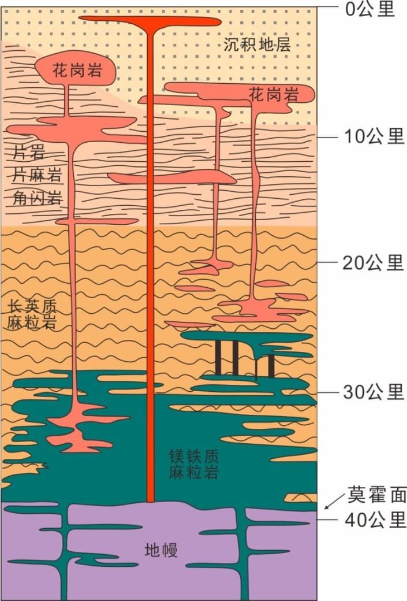

```{css}
#| echo: false

.center {
  text-align: center;
}

div.img, div.figure {
  text-align: center;
  display: block;
  margin-left: auto;
  margin-right: auto;
}

.sidebar {
  border: 1px solid #ccc;
}

.rmdwarn {
  border: 1px solid #EA4335;
}

.rmdnote {
  border: 1px solid #FBBC05;
}

.rmdtip {
  border: 1px solid #34A853;
}

.sidebar, .rmdwarn, .rmdnote, .rmdtip {
  border-left-width: 5px;
  border-radius: 5px;
  padding: 1em;
  margin: 1em 0;
}

div.rmdwarn::before, div.rmdnote::before, div.rmdtip::before {
  display: block;
  font-size: 1.1em;
  font-weight: bold;
  margin-bottom: 0.25em;
}

div.rmdwarn::before {
  content: "警告";
  color: #EA4335;
}

div.rmdnote::before {
  content: "注意";
  color: #FBBC05;
}

div.rmdtip::before {
  content: "提示";
  color: #34A853;
}
```


# 写作背景 {#background}

```{r}
#| label: ggplot2-logo
#| echo: false

blogdown::shortcode("figure",
  src = "img/ggplot2.svg",
  width = "25%", caption = "ggplot2: Create Elegant Data Visualisations Using the Grammar of Graphics",
  link = "https://github.com/tidyverse/ggplot2",
  alt = "Create Elegant Data Visualisations Using the Grammar of Graphics",
  target = "_blank", class = "center"
)
```

因在统计应用领域的卓越贡献，Hadley Wickham 获得 2019 年考普斯会长奖（COPSS Presidents’ Award），**ggplot2** 包 [@Hadley2016] 厥功至伟。

2020 年左右，我得知[tidytuesday](https://github.com/rfordatascience/tidytuesday)项目，这个项目很有意思。

1. 找真实的数据，传播信息，开启话题。
1. 宣传 **ggplot2** 包和 dplyr 包，品牌营销。
1. 探索各种各样的可视化形式，给人启发。
1. 引人入坑 R 语言和数据可视化，壮大社区。

一直没有时间参与，后来，我决定自己找数据，做一些类似的数据分析项目。翻翻旧博客，看到 2019 年曾尝试分析地震数据，不过是[草草收场](https://d.cosx.org/d/420854)。现决定重写，从对比、趋势、分布、关系、时间和空间等方面探索和分析数据，还包含数据获取、清洗和处理的过程，不仅仅是可视化，更加注重分析的过程，数据背景和解读。

我不了解地震方面的东西，近年来，不知道是相关新闻报道变多了，还是地震本身变多了，还是个性化推荐算法越来越厉害。不禁让我产生一个疑问：地震是不是越来越频繁了？另一个很重要的原因是检查已学数据分析方法的迁移能力，大家都有自己所学的专业，所从事的行业，时间久了，在数据和业务上沉浸，对技术、方法反而陌生了。那么，找一个自己完全不了解的领域，换换思维，练练手，应该很有趣。

# 本文结构 {#structure}

除了网上搜集的地震背景信息外，下面分两个部分展开，其一是美国地震局发布的数据，包含 1973-2022 年全球 6 级以上地震（以美国为主）。其二是中国地震台网发布的数据，包含 2012-2022 年中国检测到的地震（以中国为主）。无论是美国还是中国，发布的地震数据都是以本国的地震为主，包含部分国外的地震。

经过初步了解，我先对问题「地震越来越频繁了吗？」做一下说明。地震是非常复杂的地质活动，因时因地而变，莫说预测地震，就连收集地震数据也不容易。据官方报道，过去几十年，美国、中国都在不断地提升地震的监测能力，以发现震级更小、震源更深的地震，收集更多更精确的数据。有了质量更高的数据，可以总结更精确的地震规律，从而有望将规律应用于未来的预测。本文仅有中、美两份数据，针对「地震越来越频繁了吗？」，限于数据和能力，仅做如下简略分析：

无论震级大小，统计地震次数的年度变化趋势。发现 1990 后，地震次数明显增加，但是基于现有数据，难以区分地震活动和地震监测能力影响。既然无法直接回答文章题目，就从其它维度拆解分析，总结一些地震活动的规律也好。统计地震次数随震级的分布中，发现震级越小次数越多，地震越大次数越少，大致呈现**指数级衰减**变化。地震监测能力在震源深度和地震震级上有体现，因此可以继续拆解，接着，按年统计各级地震数目变化趋势，然而，并没有发现明显规律。而后，统计地震活动的空间分布，发现美国地震局发布的数据不仅限于美国本土，它是将本国地震监测网络探测到的地震选择性的发布了，分为两个部分，其一是美国本土，其二是公海或地震带，比如它并不发布中国西南、西北地区的地震活动。在中国发布的地震数据上，也发现类似的选择性发布。

我对中国的地震数据更有兴趣，在粗浅地分析美国发布的地震数据后，也类似展开分析，但是补充更加详细的空间分析，具体到各省的统计。河北唐山（3时42分，凌晨睡觉）、四川汶川（14时28分，午睡时间）地震给人留下了深刻的印象，因此，统计了地震频次随时段的分布规律，然而，地震在时段上并没有表现出规律。**最后，通过震级与震深的关系，发现了中国当前的地震探测能力。**

因中国发布的地震数据十分有限，之后，读者可以基于更加全面的美国发布的地震数据，类似地找到美国当前的地震探测能力，以及探测能力的时间变化。再将问题「地震越来越频繁了吗？」的范围收缩到美国及周边地区，分析区域内的地震是否越来越频繁。


# 地震背景信息 {#earthquakes-background}

从自然资源部下的中国地质调查局网站 (<https://www.cgs.gov.cn/>) 了解到一些背景信息。我国使用的震级标准是国际上的里氏分级表，一共 9 个等级。小于 3 级的地震不易察觉。4.5 级及以下的地震一般不会造成破坏。大于4.5级而小于6级的地震可以造成破坏，具体破坏情况还与震源深度、震中距等多种因素有关。震级每相差1.0级，能量相差大约30倍，震级相差0.1级，释放的能量平均相差1.4倍。一个6级地震释放的能量相当于美国投掷在日本广岛的原子弹所具有的能量。一个 7 级地震释放的能量相当于 30 颗这样的原子弹，而一个 8 级地震释放的能量相当于 900 颗这样的原子弹。

- 1976 年河北唐山地震震级为 7.6 级。
- 2008 年四川汶川地震震级为 8.0 级。
- 2013 年四川雅安地震震级为 7.0 级。
- 2021 年青海玛多地震震级为 7.4 级。

更多背景信息，可以从中国地震局地震预测研究所网站(<https://www.ief.ac.cn>)新闻或发布的报告，如[2021年5月22日青海玛多 7.4 级地震科学考察报告.pdf](https://www.ief.ac.cn/upload/a5fffe35-d881-45ac-98db-0dae5c0b3593/20220223/64991645600860360.pdf)，或者中国地质调查局网站 (<https://www.cgs.gov.cn/>) 了解。

# 1973-2022 年全球地震变化 {#earthquakes-world}

## 数据准备 {#quake6}

我最早接触到地震数据集来自[谢益辉](https://yihui.org/)开发的 **MSG** 包，这个包是为书籍《现代统计图形》[@Zhao2021]准备的，里面有个数据集 quake6，记录了 1973-2010 年全球 6 级以上地震情况。这是一个 data.frame，一共 4999 条记录 9 个字段，分别是 Cat 、年份 year、月份 month、日 day、时间 time、纬度 lat、经度 long、震深 dep 和震级 magnitude。此数据集的源头是[美国地震局（USGS）](https://earthquake.usgs.gov/)，2008 年四川汶川地震才过去两年，2010 年在统计之都论坛，曾引发大家的讨论[地震是不是越来越频繁了](https://d.cosx.org/d/101510)。经过一段时间的探索之后，我又去找了美国地震局官网，下载了 1973-2022 年全球 6 级及以上的数据。对比一看，原始数据还有不少字段，如下。

```{r}
quakes6 <- read.csv(file = "data/quake-global-1973-2022-6.csv")
str(quakes6)
```

从 time 字段，提取年份、月份字段。

```{r}
quakes6 <- within(quakes6, {
  timestamp = as.POSIXct(time, format = "%Y-%m-%dT%H:%M:%OSZ", tz = "UTC")
  year = as.integer(format(timestamp, "%Y"))  
  month = as.integer(format(timestamp, "%m")) 
})
```


## 震次趋势（年度）{#quake6-year}

下面先来看看每年地震次数变化趋势，如图\@ref(fig:quake6-year)所示。

```{r}
#| label: quake6-year
#| fig.cap: "1973-2022 年世界 6级以上地震次数变化趋势"
#| fig.showtext: true

library(ggplot2)
# 按年分组计数
aggregate(data = quakes6, time ~ year, FUN = length) |>
  ggplot(aes(x = year, y = time)) +
  geom_point() +
  geom_line() +
  theme_classic() +
  theme(panel.grid.major.y = element_line(colour = "gray90")) +
  labs(x = "年份", y = "地震次数")
```

从图上来看，地震确实变多了。有坛友根据美国地震局发布的信息，解释此现象是因为探测能力变强了，能发现更多的地震，而不是地震变多了。


## 震级分布（总体情况）{#quake6-hist}

数据集 quakes6 中记录的最大地震为 9.1 级，最小地震为 6.0 级。

```{r}
range(quakes6$mag)
```

下面将震级区间 $[6,9.1]$ 作 32 等分，统计每个小震级区间内的地震数量，下图展示地震震级的总体分布情况，看起来特别像指数分布。

```{r}
#| label: quake6-hist
#| fig.cap: "1973-2022 年世界6级以上地震情况"
#| fig.showtext: true

ggplot(data = quakes6, aes(x = mag)) +
  geom_histogram(bins = 32, color = "gray40", fill = "gray90") +
  geom_freqpoly(binwidth = 0.1) +
  theme_minimal() +
  labs(x = "震级", y = "次数")
```


## 震级分布（按年分组）{#quake6-explore}


### 抖动图 {#quake6-beeswarm}

数据集 quakes6 不大，可以用 **ggbeeswarm** [@Clarke2017] 包将所有点绘制出来，添加抖动后，可以防止一定程度的覆盖重合。散点的疏密体现数据的分布，相比于直方图，附加好处是直观地展示原始信息，特别是位于分布尾部的数据。

```{r}
#| label: quake6-beeswarm
#| fig.cap: "1973-2022 年世界6级以上地震分布"
#| fig.showtext: true
#| fig.width: 6
#| fig.height: 10

library(ggbeeswarm)

ggplot(quakes6, aes(x = mag, y = as.factor(year), colour = as.factor(year))) +
  geom_quasirandom() +
  geom_jitter(width = 0.025) +
  theme_minimal() +
  theme(legend.position = "none") +
  labs(y = "年份", x = "震级")
```

从图中来看，震级之间有明显的间隔缝隙，是不连续的，实际上，震级之间的最小间隔是 0.1 级。

### 岭线图 {#quake6-ridges}

除了直方图、抖动图，还可以用岭线图来展示数据的分布变化，下图采用 ggridges 包[@Wilke2021]绘制，相邻年份的分布可以清晰对比，多个年份的分布可以看趋势。

```{r}
#| label: quake6-ridges
#| fig.cap: "1973-2022 年世界6级以上地震分布"
#| fig.showtext: true
#| fig.width: 6
#| fig.height: 8

library(ggridges)
ggplot(quakes6, aes(x = mag, y = as.factor(year), height = after_stat(density))) +
  geom_ridgeline(stat = "density") +
  theme_ridges() +
  labs(x = "震级", y = "年份")
```


### 葙线图 {#quake6-boxplot}

葙线图将 5 个分位点和离群点画出来了，就地震来说，小地震往往破坏力不大，大地震才是关注的重点，也就是图中那些离群点。

```{r}
#| label: quake6-boxplot
#| fig.cap: "1973-2022 年世界6级以上地震分布"
#| fig.showtext: true
#| fig.width: 6
#| fig.height: 8

ggplot(quakes6, aes(x = mag, y = as.factor(year))) +
  geom_boxplot() +
  theme_minimal() +
  labs(x = "震级", y = "年份")
```

地震震源的位置、深度、震级与地震监测能力的关系究竟是怎样的呢？也许要先回答这个问题，才能搞清楚大地震是明显变多了呢，还是地震监测能力升级了呢？一般来说，设备就算是老旧点，大地震监测应该不受影响吧。


### 提琴图

相比于葙线图，提琴图在刻画数据分布上更加精细些。

```{r}
#| label: quake6-violin
#| fig.cap: "1973-2022 年世界6级以上地震分布"
#| fig.showtext: true
#| fig.width: 6
#| fig.height: 8

ggplot(quakes6, aes(x = mag, y = as.factor(year))) +
  geom_violin() +
  theme_minimal() +
  labs(x = "震级", y = "年份")
```


## 震级分布（空间）{#quake6-scatter}

从地震的位置来看，基本都在板块的边界或交界处。

```{r}
#| label: quake6-scatter
#| fig.cap: "1973-2010 年世界6级以上地震分布"
#| fig.showtext: true
#| message: false
#| fig.width: 8
#| fig.height: 4

library(sf)
# 转为 sf 类型
quakes6_sf <- st_as_sf(quakes6, coords = c("longitude", "latitude"), crs = 4326)
# 绘图
ggplot() +
  geom_sf(data = quakes6_sf, aes(color = mag), cex = .1) +
  scale_color_viridis_c() +
  theme_minimal() +
  labs(
    x = "经度", y = "纬度", color = "震级",
    title = "1973-2022 年世界6级以上地震分布",
    caption = "数据源：美国地震局"
  )
```


# 2012-2022 年中国地震变化 {#earthquake-china}

<!-- 从中国看世界的地震活动，2022 年年末将使用 2022 年整年的地震数据，也顺便了解一下代码的稳定性 -->

## 数据准备 {#earthquake-ceic}

相比于美国，我更关心中国境内的地震情况，所以，从中国地震台网 <http://www.ceic.ac.cn> 下载 2012-01-01 至 2022-12-31 的地震数据。由于得到的是一个**奇葩**的 [XLS 数据文件](data/quakes_20221231.xls)，竟不能用 **readxl** 包读取，甚至用 Excel 软件打开时，弹出文件格式和扩展名不匹配的警告，还说文件可能已损坏或不安全。因此，接下来准备不把它看作是 XLS 文件，而是一个 XML 格式的文件。实际上，XLS 或 XLSX 文件可以看作某种特殊的 XML 格式，下面就用 Base R 内置的函数 `read.delim()` 读取数据。

<!-- 
再一次看见 Base R 的厉害，当 tidyverse 搞不定的时候，就用 Base R 吧，没有什么是 Base R 搞不定的，有的话，多半是使用姿势不对。 
-->

```{r}
x <- read.delim(file = "data/quakes_20221231.xls", header = FALSE)
```

读进来一个超长的字符串向量，先来看看将 xls 文件被当作文本文件读进来的内容，前几行声明文档是 XML 格式的，字符串超级长，没有数据信息，下面从第 4 个开始。

```{r}
x[4:25, ]
```

数据都藏在 Excel 文件的格子 Cell 里，不同列的数据类型可能不一样，甚至同一列还出现不同类型的数据，比如将数值当作文本。为了把它们提取出来，将所有字段当作字符串。先准备一个字符串提取函数，从给定的一个字符串向量中，按照匹配模式提取一部分。

```{r}
str_extract <- function(text, pattern, ...) regmatches(text, gregexpr(pattern, text, ...))
```

从字符串向量中过滤出含表头、发震时刻、震级(M)、纬度(°)、经度(°)、深度(千米)和参考位置等字段信息的子字符串向量。

```{r}
x_str <- str_extract(text = x$V1, pattern = "<Cell><Data ss:Type=(String|Number)>(.*?)</Data></Cell>")
x_str <- unlist(x_str)
head(x_str, 20)
```

去掉多余的字符，比如成对的 `<Cell></Cell>`，留下想要的数据字段。

```{r}
x_str_tidy <- gsub(x = x_str, pattern = "<Cell><Data ss:Type=(String|Number)>(.*?)</Data></Cell>", replacement = "\\2")
head(x_str_tidy, 20)
```

可以说，这种办法简直是把 xls 文件给砸碎了，万幸地是数据文件还可以被当作 XML 文件读取，因此只要 xls 文件坏得还不彻底，这办法总是可以用的。

那么接下来就要拼起来，拼成一个 matrix，每一行记录包含 6 个字段。字符串向量 x_str_tidy 开头 6 个元素是表头，余下的 `x_str_tidy[-c(1:6)]` 是观测值，长度为 65304，分成 6 列，一共 10884 行。


```{r}
dat <- matrix(
  data = x_str_tidy[-c(1:6)], ncol = 6, byrow = TRUE,
  dimnames = list(c(1:(length(x_str_tidy) / 6 - 1)), x_str_tidy[1:6])
)
head(dat)
```

毕竟，不同列的数据类型不一样，需要单独处理，而 matrix 要求各列类型一致，为方便后续数据操作，将数据集转为 data.frame 类型。

```{r}
dat <- as.data.frame(dat, check.names = FALSE, stringsAsFactors = FALSE)
```

查看初步整理出来的数据。

```{r}
head(dat)
```

## 数据操作

根据字段的实际类型，首先做一些基本的类型转换，如下：

```{r}
dat <- within(dat, {
  `发震时刻` <- as.POSIXlt(`发震时刻`, format = "%Y-%m-%d %H:%M:%S", tz = "UTC")
  `震级(M)` <- as.numeric(`震级(M)`)
  `纬度(°)` <- as.numeric(`纬度(°)`)
  `经度(°)` <- as.numeric(`经度(°)`)
  `深度(千米)` <- as.numeric(`深度(千米)`)
})
```

从「发震时刻」字段提取日期、年份、月份、发震时段等信息。

```{r}
dat <- within(dat, {
  `日期` <- format(`发震时刻`, format = "%Y-%m-%d", tz = "UTC")
  `年份` <- format(`发震时刻`, format = "%Y", tz = "UTC")
  `月份` <- format(`发震时刻`, format = "%m", tz = "UTC")
  `时段` <- format(`发震时刻`, format = "%H", tz = "UTC")
})
```

整理好的数据集 dat 如下：

```{r}
str(dat)
```

## 数据探索

接下来要做一些探索工作，首先呼应一下本文题目，是不是地震越来越频繁了呢？看一下各年各月的地震次数再说。

### 震次分布（棋盘图）

以年份为横轴，月份为纵轴，用不同大小的黑点表示地震次数，落纵横线交叉点上。

```{r}
#| label: cenc-count-year-month
#| fig.cap: "地震次数随时间的分布"
#| fig.showtext: true

aggregate(data = dat, `参考位置` ~ `年份` + `月份`, FUN = length) |>
  ggplot(aes(x = `年份`, y = `月份`, size = `参考位置`)) +
  geom_point() +
  theme_minimal() +
  labs(size = "次数")
```

初步看起来，地震次数有明显增加的趋势，那是不是说地震发生越来越频繁了呢？未必，根据中国地震局发布的新闻公告，地震监测预报预警能力持续提升，还有可能是之前一些小震级、远距离的地震活动没有监测出来。那么，去掉 4.5 级及以下的小地震，相当于减少监测能力的影响，统计大一些的地震数量的变化，应该能说明一些问题。


```{r}
#| label: cenc-count-year-month-45
#| fig.cap: "地震次数随时间的分布"
#| fig.showtext: true

aggregate(
  data = subset(dat, subset = `震级(M)` > 4.5),
  `参考位置` ~ `年份` + `月份`, FUN = length
) |>
  ggplot(aes(x = `年份`, y = `月份`, size = `参考位置`)) +
  geom_point() +
  theme_minimal() +
  labs(size = "次数")
```


原想，去掉一些小地震，关注可能造成破坏的大地震，但没想到的是近些年来，大地震变这么多了？这是真的吗？

实际情况是，中国地震台网发布的地震活动数据，除了中国境内，还有境外的，而且境外的多半是一些大地震。地震监测相当于空间上不均匀的震级采样，导致大地震貌似变多了。如果将震级大于等于 6 级的筛选出来，结果就不一样了，见下图。

```{r}
#| label: cenc-count-year-month-6
#| fig.cap: "地震次数随时间的分布"
#| fig.showtext: true

aggregate(
  data = subset(dat, subset = `震级(M)` >= 6),
  `参考位置` ~ `年份` + `月份`, FUN = length
) |>
  ggplot(aes(x = `年份`, y = `月份`, size = `参考位置`)) +
  geom_point() +
  theme_minimal() +
  labs(size = "次数")
```

所以，接下来，还要从震次随震级的分布和震级的空间分布继续分析。


### 震级分布（直方图）

下面按年分组，以0.2级为窗宽，统计震次随震级的分布。从数量上看，无感或有感的小地震是很多的，远远大于 4.5 级以上可能造成破坏的地震数量。


```{r}
#| label: cenc-mag-count-year-45
#| fig.cap: "地震次数随震级的分布"
#| fig.showtext: true

ggplot(data = dat, aes(x = `震级(M)`, y = after_stat(count), fill = `年份`)) +
  geom_histogram(binwidth = 0.2) +
  theme_minimal() +
  labs(y = "地震次数")
```


::: rmdtip
笔者不了解地质学，也不了解地球物理，下面仅从数据分析和统计的角度做个也许不恰当的猜想。小地震就像是随机扰动，而大地震才是揭示地球活动规律的。地震毕竟通常发生在地下数十至数百千米的地方，影响地震活动的主要因素恐怕是地球本身的构造，以及那些能够对地球产生影响的力量，比如月球、太阳系。因此，若想通过地震观察到地球真正的活动规律，恐怕不是小地震可以揭示的，也不是短短十来年或几十年的数据就可以观测出来的。
:::


### 震级分布（抖动图）

相比于直方图，还可以用抖动图展示每次地震的震级数据，如图所示。抖动图在散点图的基础上添加随机扰动，其疏密变化能体现震级的分布。

```{r}
#| label: cenc-beeswarm
#| fig.cap: "世界近 10 年的地震分布"
#| fig.showtext: true
#| fig.width: 8
#| fig.height: 8

ggplot(dat, aes(x = `震级(M)`, y = `年份`, color = `年份`)) +
  geom_quasirandom() +
  geom_jitter() +
  theme_minimal()
```


### 震级分布（岭线图）

抖动图适合于数据点不太多的情况，比如本文这样的数据集，才 1 万多观测值。如果遇到数以10万计的数据点，点与点之间重叠覆盖的情况会变严重，疏密程度不好观察，使用直方图或下面的岭线图会更合适。

```{r}
#| label: cenc-ridges
#| fig.cap: "世界近 10 年的地震分布"
#| fig.showtext: true
#| fig.width: 8
#| fig.height: 8

ggplot(dat, aes(x = `震级(M)`, y = `年份`, fill = `年份`)) +
  geom_density_ridges(show.legend = FALSE) +
  theme_ridges()
```


根据中国地震台网的背景信息，4.5级以上的地震才可能会对人和周围环境造成破环，下面考虑震级大于4.5级的地震分布。

```{r}
#| label: cenc-ridges-45
#| fig.cap: "世界近 10 年4.5级及以上震级分布"
#| fig.showtext: true
#| fig.width: 8
#| fig.height: 8

subset(dat, subset = `震级(M)` > 4.5) |>
  ggplot(aes(x = `震级(M)`, y = `年份`, fill = `年份`)) +
  geom_density_ridges(show.legend = FALSE) +
  theme_ridges()
```

一般大地震之后，有小的余震，按常理来说，双峰似乎是正常的现象。从数据上看，奇怪的是近年来双峰变成了单峰，这是为什么呢？难道大地震后的余震是逐级减小下去的？此处，留待读者继续探索。

## 数据分析

### 震级的空间分布

地震发生在人口密度越大，经济越发达的地区，造成的破坏也越大，反之，若发生在荒无人烟的地区，地震再大，也不会造成伤亡或损失。因此，接下来要看看地震震源的空间分布，为了方便后续操作，首先用 **sf** 包 [@Pebesma2018] 将数据集 dat 做类型转换。这是一个空间点数据，10441 次地震观测，8 个字段，数据集 dat 前 10 次观测数据，如下：

```{r}
library(sf)
# data.frame 转为 sf
dat_sf <- st_as_sf(dat, coords = c("经度(°)", "纬度(°)"), crs = 4326)
# 查看数据
dat_sf
```

接下来，要将所有的点画在图上，单凭肉眼是无法从 10000 多个数据点看出什么空间分布的。

```{r}
#| label: cenc-scatter
#| fig.cap: "世界近 10 年的地震分布"
#| fig.showtext: true
#| fig.width: 8
#| fig.height: 4

ggplot() +
  geom_sf(data = dat_sf, aes(color = `震级(M)`), cex = .1) +
  scale_color_viridis_c() +
  theme_minimal() +
  labs(
    title = "2012-04-26 至 2022-08-12 的地震分布",
    caption = "数据源：中国地震台网"
  )
```

中国地震台网发布的数据除了中国境内的地震，还包含不少境外的地震，可能是仪器位于中国境内，在距离中国比较远的地方，只有较大的地震活动才能被监测到。本节主要关心中国的情况，先根据大致的经纬度范围，粗略地将中国及周边地区圈出来，观察地震活动的空间分布。


```{r}
#| label: cenc-scatter-china
#| fig.cap: "中国及周边近 10 年的地震分布"
#| fig.showtext: true

ggplot() +
  geom_sf(data = dat_sf, aes(color = `震级(M)`), cex = .1) +
  scale_color_viridis_c() +
  coord_sf(xlim = c(73.68, 135.2), ylim = c(3.984, 53.65)) +
  theme_minimal() +
  labs(
    title = "2012-04-26 至 2022-08-12 的地震分布",
    caption = "数据源：中国地震台网"
  )
```

不看不知道，一看要吓一跳，似乎哪里都有地震，只是西北、西南比较多，小地震比较多。下面再将比较关心的 4.5 级以上的地震圈出来，如图。


```{r}
#| label: cenc-scatter-china-high
#| fig.cap: "中国及周边近 10 年 4.5 级及以上的地震分布"
#| fig.showtext: true

ggplot() +
  geom_sf(
    data = subset(dat_sf, subset = `震级(M)` > 4.5),
    aes(color = `震级(M)`), cex = .5
  ) +
  scale_color_viridis_c() +
  coord_sf(xlim = c(73.68, 135.2), ylim = c(3.984, 53.65)) +
  theme_minimal() +
  labs(
    title = "2012-04-26 至 2022-08-12 的地震分布",
    caption = "数据源：中国地震台网"
  )
```

粗略来看，去掉没啥破坏力的小地震后，分布依然广泛，尤其是新疆、西藏、台湾的地震活动比较多。为了更加清晰地观察到地震在各个省或自治区的分布，从[阿里云可视化平台](https://datav.aliyun.com/portal/school/atlas/area_selector)获取来自高德开放平台的中国地图数据，在上图添加中国地理边界和各省的边界。

```{r}
# 读取 GeoJSON 格式的多边形矢量地图数据
china_map <- read_sf("data/中华人民共和国.json", as_tibble = FALSE)
china_map
```

高德地图是具有甲级测绘资质的单位，一般来说，地图数据是比较权威可靠的。数据集 china_map 包含 35 个省或自治区，10 个字段，有行政编码、行政区名、市级行政区数量、区域中心、区域边界等信息。有的地理区域含有岛屿，由多个多边形组成，整个数据集是 MULTIPOLYGON 类型。


```{r}
#| label: cenc-scatter-china-high-2
#| fig.cap: "中国及周边近 10 年 4.5 级以上的地震分布"
#| fig.showtext: true

ggplot() +
  geom_sf(data = china_map, color = "gray", fill = NA) +
  geom_sf(
    data = subset(dat_sf, subset = `震级(M)` >= 4.5),
    aes(color = `震级(M)`), cex = .5
  ) +
  scale_color_viridis_c() +
  coord_sf(xlim = c(73.68, 135.2), ylim = c(3.984, 53.65)) +
  theme_minimal() +
  labs(
    title = "2012-04-26 至 2022-08-12 的地震分布",
    caption = "数据源：中国地震台网"
  )
```

添加了国界、省级地理边界后，可以清楚地看出新疆、西藏、青海、甘肃、四川、云南、台湾地震活动比较多。下面想看看能够造成较大破坏的大地震的分布情况，即 6.5 级及以上的地震分布。


```{r}
#| label: cenc-scatter-china-high-3
#| fig.cap: "中国及周边近 10 年 6.5 级及以上的地震分布"
#| fig.showtext: true

ggplot() +
  geom_sf(data = china_map, color = "gray", fill = NA) +
  geom_sf(data = subset(dat_sf, subset = `震级(M)` >= 6.5), aes(color = `震级(M)`)) +
  scale_color_viridis_c() +
  coord_sf(xlim = c(73.68, 135.2), ylim = c(3.984, 53.65)) +
  theme_minimal() +
  labs(
    title = "2012-04-26 至 2022-08-12 的地震分布",
    caption = "数据源：中国地震台网"
  )
```

过去这 10 多年里，分布在中国境内的大地震还是比较少，主要分布在西北地区。大地震的危害往往比较大，10 年发生 10 次可不能说算少了，更何况还不止 10 次呢，幸好都在人口相对较少的西部地区，但愿都是发生在人口稀少的地区，人们也能尽量避开有危险地区，比如板块交界的活跃地带。

得益于 sf 包强大的空间数据操作能力，可以圈选出经纬度位于中国地理边界内，震级在 6.5 级及以上的地震。每个省级地理区域是 MULTIPOLYGON，首先获得 MULTIPOLYGON 的凸包，

```{r}
china_map_ch <- st_convex_hull(china_map)
```

再将每个省或自治区的凸包合并起来，组成一个更大的凸包。

```{r}
china_map_union <- st_union(china_map_ch)
```

接着，将地震点在中国境内的数据过滤出来。

```{r}
sub_dat_sf <- subset(dat_sf[china_map_union, op = st_within], subset = `震级(M)` >= 6.5)
sub_dat_sf
```


最后，将过滤出来的地震位置画在中国地图上，见下图。


```{r}
#| label: cenc-scatter-china-high-4
#| fig.cap: "中国近 10 年来的地震分布"
#| fig.showtext: true

ggplot() +
  geom_sf(data = china_map, color = "gray", fill = NA) +
  geom_sf(data = sub_dat_sf, aes(color = `震级(M)`)) +
  scale_color_viridis_c() +
  theme_minimal() +
  labs(
    title = "2012-04-26 至 2022-08-12 的地震分布",
    caption = "数据源：中国地震台网"
  )
```

这样就比较清晰了，不过，有的地震正好在中国与其他国家的边界周围，凸包操作有个别误伤。


### 震次的时段分布

地震带来的破坏程度还与发震时间有关，比如 1976 年河北唐山地震伤亡惨重的原因之一是地震发生在深夜3点42分，绝大多数人还在室内熟睡。因此，接下来还要分时段统计地震次数。把一天划分为 24 个时段，统计地震次数随时段的分布，如图。

```{r}
#| label: cenc-count-year
#| fig.cap: "地震次数随时间的分布"
#| fig.showtext: true

ggplot(data = dat, aes(x = `时段`, y = after_stat(count), fill = `年份`)) +
  geom_bar() +
  theme_minimal()
```

原想结合 10 来年的数据，看看地震是不是倾向于在什么时间段发生，可是从图中来看，地震好像对时段没有什么偏好，不管你白天还是黑夜，都可能发生，而且还比较均匀地分布在各个时段上。

此外，由于收集到的数据太少，才 10 年，若是有几百年的数据，说不定可以了解到整个地震活动的周期性，类似太阳黑子的活动周期那样。

再者，会不会是小地震太多，掩盖重要的地震信息？下面仅考虑 4.5 级以上的地震，如图。

```{r}
#| label: cenc-count-year-45
#| fig.cap: "地震次数随时间的分布（4.5级以上）"
#| fig.showtext: true

ggplot(
  data = subset(dat, subset = `震级(M)` > 4.5),
  aes(
    x = `时段`, y = after_stat(count),
    fill = `年份`
  )
) +
  geom_bar() +
  theme_minimal()
```

看起来，还是四平八稳地分布在24个时段上，并没有显现出一些特别的时间规律，地震还真是想啥时候来就啥时候来。


```{r}
#| label: cenc-count-year-6
#| fig.cap: "地震次数随时间的分布（6级及以上）"
#| fig.showtext: true

ggplot(
  data = subset(dat, subset = `震级(M)` >= 6),
  aes(
    x = `时段`, y = after_stat(count),
    fill = `年份`
  )
) +
  geom_bar() +
  theme_minimal()
```


### 震级与震深的关系

震级一样的情况下，震源深度越深，破坏越小，反之，震源深度特别浅，破坏性越大。此外，地下不同的深度，对应地球不同的圈层，在不同的圈层里，地球活动起来的能量是不一样的。

{ width=50% }

图\@ref(fig:earth)来自[中国地质调查局网站](https://www.cgs.gov.cn/)，展示不同深度下的岩层概况。下图展示震级随震深的关系

```{r}
#| label: cenc-mag-depth-year
#| fig.cap: "震级和震深的关系"
#| fig.showtext: true

ggplot(data = dat, aes(x = `深度(千米)`, y = `震级(M)`, color = `年份`)) +
  geom_point() +
  theme_minimal()
```

不难看出，在地下 300 公里以后，几乎都是 5-7 级的地震，小地震没有，更大的 7-8 级地震也很少。**总的来说，地下很深的位置往往发生大地震，而大地震不一定发生在地下很深的位置**。

通过此图可以看出我国地震监测或感知的能力，就是说地震发生在地下50公里以上，震级3级以下是测不出来的，相当于盲区。地震发生在地下 300 公里以下，地震震级 4.8 级以下，也测不出来，也是盲区。

注意到一个有意思的数据情况，有的地震深度为 0，而且每年或多或少包含一些深度为 0 的「地震」，其实是矿震、塌陷、爆破、滑坡等，比如 2021 年地震仪监测到的一些塌陷事故。

```{r}
subset(dat, subset = `深度(千米)` == 0 & `年份` == 2021)
```


# 环境信息 {#session}

在 RStudio IDE 内编辑本文的 R Markdown 源文件，用 **blogdown** [@Xie2017] 构建网站，[Hugo](https://github.com/gohugoio/hugo) 渲染 knitr 之后的 Markdown 文件，得益于 **blogdown** 对 R Markdown 格式的支持，图、表和参考文献的交叉引用非常方便，省了不少文字编辑功夫。文中使用了多个 R 包，为方便复现本文内容，下面列出详细的环境信息：

```{r}
xfun::session_info(packages = c(
  "knitr", "rmarkdown", "blogdown",
  "ggplot2", "ggbeeswarm", "ggridges",
  "sf", "MSG", "showtext"
), dependencies = FALSE)
```


# 参考文献 {#refer}

<div id="refs"></div>
